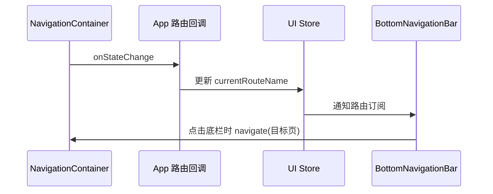

# 优化导航栏切换卡顿

## 1. 背景与目标

底部导航栏在“首页、收藏夹、用户画像、设置”之间切换时存在卡顿反馈。目标是减少切换期间无关的页面树渲染和整页转场工作，同时保留搜索、详情、播放器等页面原有的导航行为。

## 2. 现状与问题描述

- 应用使用 `@react-navigation/stack` 注册各页面，底栏通过 `navigation.navigate()` 切换主页面。
- 已提交版本把当前路由保存在 `App` 本地状态中。导航状态变化后，路由名更新会使 `App` 根组件再次渲染，连带重新构造导航容器主题、屏幕配置及全局组件树。
- 普通主题的 Stack 默认执行卡片转场；玻璃主题关闭了转场动画。
- 底栏同时承载迷你播放器和玻璃背景。切换选中项时，播放器子树原先也会随父组件重新渲染；玻璃背景还支持原生 `BlurView`。

## 3. 分析与排查过程

当前路由更新链路为：

- `src/App.tsx` 的 `onStateChange` 只把路由名写入 UI Store；`BottomNavigationBar` 单独订阅 `currentRouteName`。路由变化不再通过 `App` 本地 `setState` 刷新全局根树。
- 底栏的 `GlassView` 设置 `noBlur` 后，不再创建 `BlurView`；本轮同时移除了导航胶囊和迷你播放器的系统阴影，半透明底色与边框仍保留。
- 底栏目标页仍属于 Stack 页面。普通主题下，四个底栏目标路由此前继承默认转场，切换期间会执行整页卡片过渡。
- Discover 和合集推荐页会请求 daily 刷新；请求由共享推荐 Store 的自动刷新闸门控制。5 小时刷新间隔在本轮推荐逻辑优化中另行处理。
- 本机 `adb devices -l` 没有连接设备，且没有配置 AVD。尚无法采集真实设备的帧率、JS/UI 线程耗时或点击到首帧时延。

## 4. 根因与置信度

已确认的代码级额外开销是：路由状态曾触发整个 `App` 根树更新；普通主题的底栏目标页继承整页 Stack 转场；底栏路由更新还会无条件重新执行迷你播放器组件。工作区已有改动已隔离路由状态、关闭底栏玻璃层的原生模糊并隔离播放器子树。本轮为四个底栏目标页设置轻量淡入上移转场，保留页面间的切换反馈。

这些路径能解释切换时的额外渲染和转场工作，但没有设备性能采样，不能断言它们是所有卡顿场景的唯一运行时原因。页面首次挂载或焦点回调里的同步数据处理仍待真机剖析。

## 5. 方案设计与取舍

- 主页面按 Tab 语义切换，因此仅对 Discover、Folders、Settings、TagRecommendations 设置 `animation: 'fade_from_bottom'`；Videos、Search、播放器和其他详情页面沿用现有转场。
- 将当前路由状态放在 UI Store，并在路由名未变化时返回同一状态对象，避免无意义的 Store 通知。
- 对导航栏与迷你播放器使用 `React.memo`。播放器打开回调保持稳定，使路由选中态变化不会单独触发播放器组件重渲染；其播放状态、进度和主题订阅仍可独立更新。
- 底栏玻璃层不再实时模糊背景，视觉上保留半透明底色，降低原生背景模糊成本。

## 6. 核心修改

- `src/App.tsx`：保留路由状态与导航配置的稳定化；为四个底栏目标页统一配置淡入上移转场。
- `src/store/uiStore.ts`：仅在当前路由名真正改变时更新 Store。
- `src/components/BottomNavigationBar.tsx`：独立订阅路由、稳定播放器回调并用 `React.memo` 隔离无关父级更新；禁用该栏的原生模糊层和系统投影。
- `src/components/MiniPlayer.tsx`：用 `React.memo` 避免仅由导航栏选中态变化引起的播放器重复渲染，并移除播放器容器的系统投影。
- `src/screens/TagRecommendationsScreen.tsx`：按 UID 与可见收藏范围缓存画像快照；普通路由失焦不取消本地读取，返回页面时复用已读数据。

## 7. 风险与影响范围

- 四个主页面切换改为淡入上移转场；非底栏详情页的转场未改变。
- 底栏背景不再实时模糊其后内容，保留半透明颜色和边框；悬浮框不再绘制四周黑色系统阴影。
- 用户画像在账号或可见收藏范围不变时只读取一次；收藏范围或后台标签补齐发生变化后会重新构建快照。
- 页面内部数据加载与同步计算未调整；若真机上卡顿仍集中在某一页首次进入或重新聚焦，应针对该页面单独采样。

## 8. 验证方案与结果

- 源码结构对照：路由变化引起的 `App` 本地状态更新由 1 次降为 0 次；底栏原生 `BlurView` 由 1 个降为 0 个；四个底栏目标页统一使用 Stack 的 `fade_from_bottom` 转场；播放器在 props 不变时不再因底栏父组件更新而渲染。以上是静态调用/组件路径计数，不代表实测毫秒或帧率。
- `git diff --check`：通过。
- 定向 ESLint：仓库格式规则对已有 CRLF/Prettier 报错；关闭 Prettier 规则后仍有 `App.tsx` 既有未使用变量与 Hook 依赖错误，导航相关改动行没有 ESLint 错误。
- TypeScript 全量检查未通过：报告集中在未修改的 `src/store/folderDataStore.ts` 和根目录旧文件 `trackPlayer_backup.ts`，本次改动文件未出现在错误列表。
- 未运行自动化测试。当前没有连接 Android 设备或已配置 AVD，因此未验证真实帧率和切换时延。

## 9. 最终结果

代码已减少主页面切换期间的根组件更新和底栏模糊，并让迷你播放器跳过无关的路由更新渲染；四个底栏目标页现在采用淡入上移过渡。实际设备上的卡顿改善幅度待连接设备后测量。

## 10. 技术价值与后续事项

此次将导航选中态的状态更新范围收敛到底栏，并让底栏目标页采用 Tab 式切换行为，降低转场期间同时处理多个页面层的工作量。后续可在同一台设备上记录优化前后的点击到页面首帧时间及 JS/UI 帧率；若单页仍有明显阻塞，再分析其首次挂载和焦点回调中的同步工作。

## 11. 主导航切换改为水平滑动（2026-09-28）

### 背景与目标

- 四个底部主页面原先使用 `fade_from_bottom`，与用户期望的左右页面切换方向不一致。
- 只调整底部四个主页面的切换方向，其他页面动画在后续全局转场优化中单独处理。

### 修改与验证

- `src/App.tsx`：将 Discover、Folders、Settings、TagRecommendations 的专属 Stack 动画改为 `slide_from_right`。
- 已确认当前使用的 `@react-navigation/stack` 支持该动画名称。未运行测试、构建或设备验证，实际动画观感仍待真机确认。

## 12. 导航选中高亮随页面滑动（2026-09-28）

### 修改

- `src/components/BottomNavigationBar.tsx`：将每个按钮各自的选中底色替换为单个绝对定位的 Animated 指示层；路由变化时通过原生驱动的 `translateX` 移动指示层。
- 将主题主色作为选中层阴影色，阴影随指示层一起移动；图标与文字继续按当前路由立即更新颜色。

### 验证与限制

- `git diff --check` 通过。未运行测试、构建或设备验证；不同屏宽和系统阴影表现仍待真机确认。
