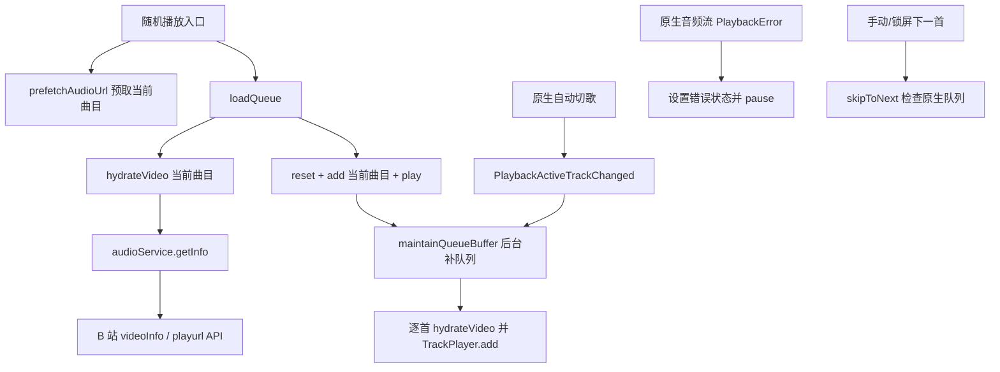

# 自动切歌后播放中断与队列失效排查

## 1. 背景与目标

用户报告两类现象：弱网波动后自动切歌，下一首加载失败并结束播放；以及正常播放一段时间后自动切歌失败，当前曲目与后续切歌都不可用，重新从首页随机播放后暂时恢复。本次只做代码与 Git 历史排查，没有修改播放器代码。

目标是区分队列编排、音频流错误恢复和 B 站 API 限流各自的作用，并标明哪些结论仍需设备日志确认。

## 2. 证据范围与限制

- 已检查 `trackPlayer`、`audioService`、B 站 API/HTTP 限流、URL/音频缓存、播放入口和相关 Git 历史。
- 当前工作区没有用户设备的运行日志或故障现场；未在设备上复现。因此本文把静态代码能确认的行为与对症状的解释性推断分开。
- 未运行测试或修改业务代码。本次请求是排查结论，现场网络状态和服务端响应仍需日志验证。

## 3. 当前播放与数据链路

具体入口：`VideosScreen.shuffle` 先设置逻辑队列、对当前目标调用 `prefetchAudioUrl`，随后调用 `loadQueue`；`FoldersScreen` 的全局随机播放走同一套 `loadQueue`。`loadQueue` 解析当前目标后重置原生队列、添加并播放，之后由 `maintainQueueBuffer` 补充后续曲目。原生切换曲目时，`PlaybackActiveTrackChanged` 更新 store 并再次触发队列维护。

## 4. 已确认的问题与证据

### 4.1 队列可能在后台补充完成前耗尽，耗尽后没有恢复入口

- `loadQueue` 只水合目标歌曲，然后 `reset → add → play`；后续曲目由异步 `maintainQueueBuffer` 补充。因而新队列启动时原生队列可以只有当前一首。见 `src/services/trackPlayer.ts:318-369`。
- `maintainQueueBuffer` 读取一次 `nativeQueue`、`activeIndex` 和 `remaining`，之后用串行 `await hydrateVideo(video)` 逐首解析并追加。遇到解析失败会跳过当前曲目继续尝试，但不会为网络恢复设置重试任务。见 `src/services/trackPlayer.ts:235-315`。
- 没有注册 `PlaybackQueueEnded` 处理器。`PlaybackActiveTrackChanged` 遇到 `e.index === undefined` 会直接返回；因此队列结束后没有代码重新补队列并恢复播放。见 `src/services/trackPlayer.ts:598-632`。
- `skipToNext` 在 `remaining <= 0` 时只提示“稍后再切歌”、异步触发补队列，然后立刻返回；不会等待曲目补入后再执行 skip。见 `src/services/trackPlayer.ts:510-543`。

**判断：**这是第 1 类现象的主因链路。弱网或 API 延迟时，当前曲目可以先播完，而下一首尚未进入原生队列；之后即使后台补入了曲目，也没有队列结束后的自动恢复动作。用户再点击“随机播放所有歌曲”会重建原生队列，所以可能暂时恢复。

### 4.2 已进入原生队列的音频流报错会被终止暂停

- 当前 `PlaybackError` 处理器只记录错误、设置 `playbackError` 并调用 `TrackPlayer.pause()`；没有重试当前音频、失效化 URL 缓存、切换 CDN 备选地址或跳到下一首。见 `src/services/trackPlayer.ts:634-638`。
- 当前 `hydrateVideo` 把解析出的 URL 放入短期 URL 缓存；`audioService.getInfo` 还会缓存音频 URL。播放报错路径没有调用 `invalidateUrl`、`audioService.invalidate` 或 `invalidateDomainCache`。缓存实现见 `src/services/trackPlayer.ts:152-172`、`src/services/urlCache.ts:13-22`、`src/services/audioService.ts:51-64,129-191`。
- Git 历史显示，`64c031f` 前的通用 `PlaybackError` 路径在有网络时会尝试 `skipToNext`；当前重构版本改成了暂停并显示错误。该版本此前还有占位轨道 lazy-resolve 的自动恢复路径，而当前路径已改为真实 URL 队列。

**判断：**这是第 2 类现象的另一条直接故障路径。若自动切换到的真实 CDN 地址播放失败，播放器会停在错误处理路径，不会自行恢复；若该 URL 同时仍在缓存中，之后重新尝试也可能继续使用同一地址。实际是否为 CDN 超时、URL 失效或设备解码错误，需看 `PlaybackError` 日志详情。

### 4.3 CDN 域名缓存会把一首歌的完整 URL 复用于同域的其他歌曲

- `domainSpeedCache` 以 hostname 为 key，但写入的是完整 `fastest` 音频 URL；后续只要遇到相同 hostname 且缓存未过期，就直接把该完整 URL 当成新 BVID 的 URL 返回。见 `src/services/audioService.ts:42-44,56-64,93-108`。
- `hydrateVideo` 将 `audioService.getInfo` 返回的 URL 直接绑定到当前视频的 Track。见 `src/services/trackPlayer.ts:164-168,185-196`。因此，同 CDN 域名下后续曲目的原始 playurl 可能被前一首曲目的完整 URL 替代。`fastestUrl:${bvid}` 也没有 CID/音质维度，同一多 P 视频不同分 P 可能互相复用 URL。
- 若所有 CDN 探测都因瞬时网络问题失败，代码仍把原始 `baseUrl` 写进 BVID 缓存和域名缓存；之后会继续复用该 URL，而播放报错路径又不会使缓存失效。见 `src/services/audioService.ts:102-108`。

**判断：**这是代码层面可直接确认的 URL 缓存键/值不匹配问题。运行时表现可能是自动切歌后播放到上一首的音频，也可能是错误 URL 播放失败；具体结果取决于故障时两个 playurl 的 URL 和 CDN 响应，需要日志或抓取值确认。它与用户描述的切歌后失败高度相关，应优先修复。

### 4.4 错误播放 URL 可能被持久化为目标歌曲的离线缓存

- `hydrateVideo` 在音频缓存未命中时会后台执行 `audioCache.download(cacheKey, quality, url, headers)`。见 `src/services/trackPlayer.ts:152-172`。
- 音频缓存文件按传入的曲目 key 保存，命中后 `hydrateVideo` 会优先返回本地文件；缓存元数据没有原始音频 URL 或其校验值。见 `src/services/audioCache.ts:10-21,35-48,50-97`。

**推断：**若上一节的跨 BVID URL 被用来下载，错误音频可能被保存到当前 BVID/CID 对应的缓存 key；之后播放会命中本地文件，绕过新的 playurl 解析。旧缓存没有来源信息，无法可靠识别哪些文件已受影响。

### 4.5 单航班补队列可能丢失后续维护触发，并允许旧队列任务污染新队列

- `maintainQueueBuffer` 用全局 `hydratingPromise` 做 single-flight；已有任务时，新触发直接返回同一个 Promise，不安排任务完成后的二次检查。它在异步循环中使用开始时捕获的逻辑队列、原生队列和活动索引，不在每次追加前重新校验队列版本。见 `src/services/trackPlayer.ts:28-30,235-315`。
- 新队列通过 `TrackPlayer.reset()` 重建，但 reset 与正在运行的补队列任务没有共享互斥/取消/版本门禁。见 `src/services/trackPlayer.ts:343-356`。

**推断：**若自动切歌事件在补队列 Promise 运行期间到达，新触发可能只复用旧 Promise；若这期间又重建了队列，旧任务可能基于旧逻辑队列继续向新原生队列追加曲目。该竞态可以造成原生队列与逻辑队列不一致，是“需要重新建队列才能恢复”的可能放大因素；没有现场事件时间线，暂不能认定它就是本次每次故障的触发点。

## 5. B 站限流与预加载的关系

- 真实音频元信息由 `audioService.getInfo` 获取；缓存未命中时请求视频信息和 playurl。playurl 经 `biliGet`，由全局自适应限流器管控。见 `src/services/audioService.ts:129-191`、`src/services/biliApi.ts:64-86`、`src/core/http.ts:20-60`。
- 配置允许 6 次重试，而 `biliGet` 的循环是 `attempt <= retries`，即最多 7 次请求尝试；单次超时设为 60 秒。`RateLimitError` 分支等待指数退避后还会继续执行通用线性等待，限流时会叠加两段等待。见 `src/config/index.ts:21-34`、`src/core/http.ts:71-78,146-160`。
- 限流配置声明每秒 1 次、突发 2 次，但 HTTP 实际使用的 `adaptiveBucket` 以 `2` 初始化；前 10 次成功之前速率仍可能高于配置值。见 `src/config/index.ts:24-28`、`src/core/adaptiveRateLimit.ts:15-21,94`。
- 这会拉长后台水合时间，**限流是队列补充不足的合理放大因素，但当前没有设备日志证明本次实际命中 412/429**。API 限流和 ExoPlayer 播放 CDN 音频失败是不同故障面，不能把两者当成同一个错误。
- `dataPrefetcher.prefetchNextTracks` 和 `prefetchFirstTrack` 当前没有生产调用点；`trackPlayer.ts` 也没有导入该模块。播放入口仅对本次目标曲目调用 `prefetchAudioUrl`，后续曲目的真实 URL 仍由 `maintainQueueBuffer` 串行水合。见 `src/services/dataPrefetcher.ts:82-118` 及 `VideosScreen.tsx:280-319,375-397`。

## 6. Git 历史线索

- `64c031f`（动态滑窗重构）移除了此前的队列版本门禁、占位符 lazy-resolve 和通用播放错误自动跳过/恢复路径，当前 `PlaybackError` 处理收敛为暂停。
- `b418153` 将 `loadQueue` 从“并行水合初始窗口”改为“先只加载目标曲目，后台补队列”，降低首曲等待，但也扩大了启动时原生队列尚未准备好的时间窗口。
- `0470bd3` 引入域名测速缓存；当前实现中缓存值是完整音频 URL，而非只缓存可复用的 CDN 域名选择结果。
- 以上历史说明当前故障与队列架构及恢复路径调整相关；它们是代码演变证据，不代替设备日志对故障触发条件的确认。

## 7. 结论与建议的修复方向

### 结论

1. **已确认的主问题：**队列在弱网下可能补充不及时，队列耗尽没有自动恢复机制；这是自动切歌后停止播放的最强代码解释。
2. **已确认的第二问题：**原生音频流报错会直接暂停，缺少重试、缓存失效或自动跳过；这能解释当前曲目失败且播放不继续。
3. **已确认的缓存缺陷：**同域歌曲可能共用一条完整播放 URL；这是自动切歌后拿到错误音频地址的直接代码原因。
4. **可能的持久化放大因素：**错误 URL 有机会被下载并缓存到目标曲目 key；已落盘缓存是否受影响未知。
5. **可能的并发放大因素：**全局 single-flight 补队列没有队列代次校验，也没有“任务完成后重跑”的机制，存在丢触发与过期队列追加风险。
6. **B 站限流：**代码有 412/429 退避重试，且退避可能被重复叠加；它能造成补队列慢，但本次是否命中仍未知。
7. **下一首预取：**独立 `dataPrefetcher` 的后续曲目预取没有接入当前链路，不能作为队列耗尽的兜底。

## 8. 修复方案（建议实施顺序）

### 8.1 目标与约束

- 每个 BVID/CID/音质只能使用该资源当前 playurl 响应中的 URL；跨歌曲缓存只记录 CDN 主机偏好，不复用完整媒体 URL。
- 保留“当前曲目先播”的快速路径，同时确保下一首补充失败或队列耗尽后有明确恢复流程。
- 所有网络重试有次数和总时限；限流、断网和永久无资源分别处理，避免后台请求无限堆积。
- 播放器错误处理不得在队列重建或用户暂停后擅自恢复播放。

### 8.2 方案比较与选择

| 方案 | 好处 | 代价 / 未解决点 | 结论 |
|---|---|---|---|
| 单纯把原生缓冲从 12 首继续加大 | 改动小，短时水合慢时更不容易耗尽 | 增加 playurl 请求量；错误 URL 与 PlaybackError 无恢复仍存在；弱网时无法保证 | 不单独采用 |
| 静音占位轨道 | 原生队列不会立即见底 | 需要管理占位切换、暂停恢复和多端媒体状态，容易引入新的死锁或重复播放 | 暂不采用 |
| 修 URL 缓存 + 队列协调器 + 有界错误恢复 | 保留首曲快速启动，并从资源身份、并发和恢复三处闭环 | 需要新增队列状态边界测试；失败策略需固定 | **推荐** |

推荐方案继续由 `trackPlayer` 负责原生队列，避免同时增加第二个预取调度器。保留目标曲目预取的单飞请求合并，下一首 URL 解析和原生入队由同一队列协调器管理。

### 8.3 分阶段实施

#### 阶段 A：修复资源 URL 与本地缓存身份

1. 改造 `selectFastestUrl`：域名级缓存只保存 hostname/偏好信息；新曲目必须从该曲目自己的 `baseUrl` 和 `backupUrls` 中选择匹配的候选地址。不得把上一首曲目的完整 URL 返回给新 BVID。
2. 将单曲选择缓存按 BVID、CID、音质隔离；或者移除重复的 `fastestUrl` 缓存，依赖已有按 BVID/CID/音质构建的 `audioInfo` 缓存。全候选探测失败时可以把当前曲目的原始 URL 作为一次性回退，但不能把它记录成跨歌曲的可用 CDN 偏好。
3. 扩展音频缓存元数据，记录资源身份（BVID、CID、音质）及来源 URL 的摘要；命中时验证身份。下载继续使用临时文件，下载成功且身份匹配后才提交元数据。
4. 旧音频缓存没有来源 URL，无法识别错误下载。建议升级缓存版本并将旧缓存整体标记为不可用；可选择启动时清理，或在歌曲下次联网播放时惰性清理。无论采用哪种方式，都不能把旧缓存当成已验证资源。**影响：旧版本缓存歌曲需要重新下载，离线可用性会暂时下降。**
5. 暴露按 BVID/CID 失效化的接口，同时清理 `audioInfo`、内存 URL 和对应音频文件缓存；瞬时播放错误不能继续复用同一个缓存结果。

#### 阶段 B：让队列补充任务可重入且与队列代次一致

1. 增加 `queueRevision`，在新建/重排/替换队列时递增。每个水合任务携带 revision，在异步水合结束以及 `TrackPlayer.add/skip` 前检查；过期结果不允许进入原生队列。
2. 对 `reset/add/skip` 等原生队列修改使用同一个短临界区互斥；网络请求在临界区外执行，避免慢请求锁住播放器。新队列 reset 必须排在已开始的原生 add 之后并清除其结果。
3. 将 single-flight 改为“合并触发的 drain loop”：维护期间新事件设置 dirty 标记；当前轮结束后读取最新原生队列和活动索引，再补一次，避免事件只复用旧 Promise 后丢失。
4. 每轮水合前重新读取当前队列状态；对暂时断网/限流停止本轮并安排有界重试，对确定无资源的歌曲记录失败并继续。低水位/目标缓冲量依据实测水合时长调整，不先增加请求量。

#### 阶段 C：补齐队列结束、手动下一首和播放错误恢复

1. 注册 `PlaybackQueueEnded`（当前安装的 Track Player 定义了该事件）。如果用户此前处于播放意图且逻辑队列还有曲目，协调器水合下一首、添加后显式跳转并恢复播放；若逻辑队列也结束，则正常结束，不循环重试。
2. 手动/锁屏 `skipToNext` 遇到原生队列为空但逻辑队列仍有下一首时，等待同一个有界补充任务一次，再跳转；补充失败时展示明确错误和重试入口，不把“队列没准备好”报告为“防止限流”。
3. `PlaybackError` 按当前 BVID/CID/revision 去重。推荐的默认策略是：在线的瞬时播放错误使当前 URL 缓存失效并重新解析一次；再次失败后跳过该失败曲目并继续队列。断网时等待网络恢复或用户重试；永久无资源时记录并跳过。所有自动恢复都必须检查用户当前播放/暂停意图和队列 revision。
4. 失败次数耗尽且没有后续曲目时，将状态显示在播放器界面并提供手动重试；避免只有日志或一个不会被消费的 store 字段。

#### 阶段 D：修正 API 限流等待并补可观测性

1. `RateLimitError` 每次尝试只执行一种退避；修复当前指数等待后继续落入线性等待的重复等待。设置明确的总时限，并允许过期 queueRevision 不再等待/提交旧结果。
2. 自适应限流器初始速率与 burst 从同一配置读取，避免当前配置声明和 `new AdaptiveRateLimiter(2)` 的实际初始行为不一致；保留 412/429 后降速及成功后缓慢恢复。
3. 记录队列 revision、当前 BVID/CID、native queue 长度、remaining、水合耗时/结果、错误类别和恢复动作。URL 日志应只记录 host 与 URL 摘要，不记录 Cookie 或完整带签名 URL。

### 8.4 影响范围

| 文件 / 模块 | 变更 |
|---|---|
| `src/services/audioService.ts` | 修复跨资源 CDN URL 复用、URL 选择缓存和失效化 |
| `src/services/audioCache.ts` | 缓存身份校验、旧缓存版本处理、原子提交/定向清理 |
| `src/services/trackPlayer.ts` | 队列 revision、drain loop、QueueEnded/PlaybackError/RemoteNext 恢复 |
| `src/core/http.ts`、`src/core/adaptiveRateLimit.ts`、`src/config/index.ts` | 单次退避、总时限、限流配置一致性 |
| `src/screens/PlayerScreen.tsx` / `src/store/playerStore.ts` | 显示最终错误和可重试状态；仅在需要时修改 |
| `__tests__/` | URL 缓存、重试和队列并发的回归测试 |

不需要数据库迁移，也不改变 B 站 API 或持久化播放队列格式。`dataPrefetcher.prefetchNextTracks` 当前没有调用方；本次不再并行引入第二个补队列机制，可在确认无其他动态引用后单独清理死代码。

### 8.5 验收标准与验证计划（尚未执行）

- **AC-1 URL 隔离：**两首不同 BVID 但相同 hostname 的 playurl 有不同路径时，第二首 Track 使用第二首自己的候选 URL；不同 CID/音质也不会复用其他资源的地址。
- **AC-2 探测失败：**所有 HEAD/Range 探测失败时，当前曲目最多使用自己的原始 URL 回退；后续同域歌曲不会命中该失败 URL 作为域名偏好。
- **AC-3 旧缓存：**旧版音频缓存按约定失效；新版下载只会在资源身份匹配后被 `has()` 命中。
- **AC-4 队列并发：**补队列期间切歌时维护任务按最新活动索引补齐；更换队列期间旧 revision 不能向新队列追加歌曲；多个事件不会重复添加同一 BVID/CID。
- **AC-5 队列耗尽：**模拟当前曲目结束时下一首尚未水合，`PlaybackQueueEnded` 会有界等待、入队并恢复一次；网络持续不可用时不会形成无限重试或重复播放。
- **AC-6 播放错误：**瞬时错误最多重新解析一次；第二次失败按策略跳过/显示最终错误；用户手动暂停或队列更换后，旧错误回调不得自动恢复播放。
- **AC-7 限流：**412/429 每轮只等待一段退避，尝试数和总耗时有上限；请求速率从配置初始化。
- 自动化层使用 Jest + Track Player mock 覆盖 URL 选择、缓存迁移、队列竞态及退避；Android 手工验收覆盖弱网/断网恢复、短曲目队列耗尽、锁屏下一首及同 CDN 连续播放。

### 8.6 风险与实施决策

- **缓存影响：**旧缓存元数据没有来源信息，无法筛出可信条目。实施选择切换到 `audioCache:meta:v2`，旧索引不再命中；旧媒体文件不做批量删除，避免无提示地删除用户文件。旧曲目需要重新联网下载，旧文件会暂时占用磁盘；设置页“清理缓存”仍会清理新旧索引引用的文件。
- **失败策略：**按有界自动恢复实施：当前播放 URL 失效后重新解析一次，仍失败再跳过并提示；队列变更、用户暂停或网络不可用时不自动恢复播放。
- **尚未确认：**现场是否命中 412/429、CDN 是否返回特定错误，以及既有缓存中实际受污染的比例，需用设备日志/缓存情况确认。

此前排查阶段未运行测试或设备验证。实现后应先跑定向 Jest 回归，再进行 Android 原生播放器和锁屏媒体控制验收。

代码中 `LoggerService` 将日志写入应用私有目录，并在设置页提供导出入口；见 `src/services/LoggerService.ts:28,54-61,192,299`、`src/screens/SettingsScreen.tsx:484`。现场日志由用户设备生成，当前工作区无法读取。

## 9. 当前实施记录

### 9.1 修复播放地址跨歌曲复用

- `audioService.ts` 已移除按 BVID 单独缓存完整测速 URL 的逻辑。全局偏好现在按原始主机保存优选 hostname；命中后必须从当前 playurl 响应的 base/backup URL 中挑选，因此不会把上一首歌曲带签名的完整 URL 交给下一首。
- 所有候选 URL 探测失败时，只回退到当前资源自己的 base URL，不再将失败地址登记为全局 CDN 偏好。
- `audioCache.ts` 已切换到 v2 元数据 key，使旧版无来源信息的缓存索引不再被播放命中；旧文件暂留，设置页清理操作会同时清理旧、新索引引用的文件。
- 已完成代码修改和差异检查。设备弱网及真实 B 站接口行为尚未验证。

### 9.2 修复队列补充竞态与耗尽恢复

- `trackPlayer.ts` 为队列变更增加递增代次。队列水合完成后、原生队列写入前会核对代次；旧队列的异步结果不能追加进新队列。
- 原生队列的 `reset/add/skip` 通过同一个串行入口执行，减少队列重建、预加载和用户切歌交错导致的队列错位。
- 补队列 single-flight 改为 dirty drain：维护中的新触发会要求当前工作结束后再按最新队列状态检查一次，避免触发被旧 Promise 吞掉。
- 注册 `PlaybackQueueEnded`：播放意图仍有效且逻辑队列还有后续歌曲时，等待当前补队列并定位/解析下一首后恢复播放。用户暂停会更新播放意图，恢复逻辑不会覆盖该操作。手动下一首遇到原生队列尚未补齐时，也会等待同一补队列再重试一次。
- `PlaylistPanel` 的直接 `TrackPlayer.skip` 已改为调用队列服务；播放器暂停按钮和收藏夹混播入口也改为经过播放意图封装。
- 定向 TypeScript 检查覆盖本次改动涉及的 TS/TSX 文件，结果通过；`trackPlayer.ts` ESLint 检查通过；`git diff --check` 通过。`PlaylistPanel.tsx` 当前全量 ESLint 存在两个已在 HEAD 上存在的错误（嵌套组件 Hook 依赖、未使用的 `timer`），此次没有改动这两处。
- 未运行测试套件或设备端验证。全项目 `tsc --noEmit` 仍会被仓库根目录遗留的 `trackPlayer_backup.ts` 中缺失相对模块和隐式 `any` 阻断；该文件不在本次修改范围。

### 9.3 补齐播放错误的有界恢复和界面重试

- `PlaybackError` 不再只暂停并留下不可见的 store 错误。处理器按队列代次、BVID、CID 和原生索引去重；重复回调等待当前恢复任务完成，不会递归启动第二个任务。
- 在线播放错误会失效当前曲目对应的 `audioInfo`、CDN URL 和域名偏好。若失败源是本地缓存文件，则只移除当前 BVID/CID/音质对应的缓存索引和文件，不影响同一视频的其他分P。随后重新解析一次并替换原生队列中的当前轨道。
- 新地址再次报错时，如果逻辑队列有下一首则继续跳过失败曲目；如果没有下一首或当前离线，则保留错误状态并允许用户手动重试。用户暂停后不会被自动恢复播放；异步解析结束时也会重新核对队列代次和当前原生曲目。
- `PlayerScreen` 现在显示播放错误并提供重试入口；活动曲目改变时清除旧曲目的错误提示。
- 定向 TypeScript 检查通过；`trackPlayer.ts` ESLint 检查通过。`PlayerScreen.tsx` ESLint 仍报告 4 个错误，但使用 `git show HEAD:src/screens/PlayerScreen.tsx` 对提交前版本复查得到相同错误（未使用变量和已有条件 Hook），属于基线问题；此次新增 UI 没有增加 ESLint 错误。`git diff --check` 通过。
- 未运行测试套件或 Android/iOS 设备验收，因此 Track Player 原生替换时序、真实 CDN 错误恢复和网络恢复体验仍待设备验证。

### 9.4 修正 API 限流重试和速率初始化

- `biliGet` 收到 `RateLimitError` 后现在只等待一次指数退避，再进入下一次尝试；以前等待指数退避后还会继续执行通用线性退避，使 412/429 情况下等待时间叠加。
- API 重试沿用“最多 6 次重试，不含首次请求”的既有语义；新增 180 秒总时限，并将单次请求超时限制为总时限剩余值，避免网络超时与重试退避累积成数分钟等待。登录弹窗等待用户操作不受此请求预算限制。
- `AdaptiveRateLimiter` 现在从 `config.rateLimit` 初始化：实际速率从配置的每秒 1 次开始、令牌桶容量为配置的 burst 2；收到 412/429 后将速率减半并清空令牌，连续成功后逐步恢复但不超过配置上限。
- 定向 TypeScript 检查、`http.ts` / `adaptiveRateLimit.ts` ESLint 检查及 `git diff --check` 均通过；未运行测试套件，真实 B 站限流频率和客户端等待体感仍待设备验证。
