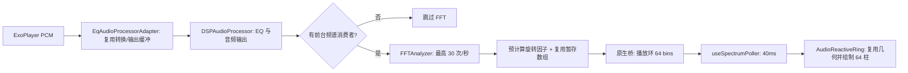

# 播放详情页交互与导航卡顿排查

## 1. 背景与目标

用户反馈播放页切歌、暂停/播放及其他操作响应迟缓，底部主导航切换也有明显卡顿；同时怀疑当前工作区未提交的唱片频谱映射修改。目标是对照差异找到能解释 JS 线程压力的实际代码路径，并降低播放时的无关 JS 工作。

## 2. 分析与排查

- 当前工作区已有 7 个未提交文件，集中在 `FFTAnalyzer.kt`、`AudioDSPModule.kt`、频谱组件和频谱轮询器，另有一份播放页重构文档变更。
- 对照 HEAD，轮询间隔仍为 80ms，频谱环仍绘制 64 根线段；FFT 内部频谱数组由最多 512 项缩至 128 项，但旧版 `AudioDSPModule` 已经把数据下采样至 128 项后再过 RN Bridge，因此桥接数据量没有因此增加或减少。现有差异没有提高轮询频率或频谱路径数量，因此不能确认这批未提交的幅度映射调整是本次卡顿的原因。
- 确认一个高频日志路径：播放页频谱每次轮询都会调用 `LoggerService.debug`；在开发构建中该分支开启。日志服务会同步格式化并写入内存缓冲，再异步追加到日志文件。80ms 间隔意味着最高约 12.5 次/秒。
- 频谱组件收到每个样本后又用 `requestAnimationFrame` 对谱数组插值，并在每帧调用 `setState`，驱动 64 段 SVG 路径重建。该循环增加了播放页 JS 工作，但不属于当前未提交幅度映射差异。

## 3. 修改方案与结果

- `useSpectrumPoller` 对原生桥接请求增加单飞保护；前一次读取未完成时跳过后续 tick，避免轮询慢于 80ms 时堆叠 Promise 和状态更新。
- 频谱诊断日志限频至每 10 秒至多一次，包括空数据和异常路径，避免开发环境持续写入日志文件。
- Android 频谱环直接使用轮询器已平滑的样本，移除按每个样本启动的逐帧 React 状态插值。保留 native FFT 平滑、JS 轮询平滑、Reanimated 唱片旋转和强度淡入淡出；谱柱随样本更新从逐帧状态刷新收敛至最多约 12.5 次/秒。

## 4. 风险与影响范围

- 频谱柱更新更接近 80ms 采样节奏，可能比旧的 JS 插值观感略有阶梯感；底层已有非对称平滑，唱片自转仍由 Reanimated 驱动。
- 播放器切歌过程中的音量淡入淡出、原生队列操作和导航容器未在本次修改；它们仍可能单独造成操作等待。
- 用户已有的频谱算法和映射工作区改动未被重置；本次只调整轮询与渲染开销。

## 5. 验证与限制

- 静态检查对照改动确认采样周期未变、轮询不会并发、开发日志频率从每秒最高约 12.5 次降至每 10 秒至多 1 次、频谱插值不再逐帧触发 React 更新。
- 未运行自动化测试或 Android 构建；当前也没有同一设备上的 JS/UI 帧耗时或点击到首帧基线。因此这是有代码证据支持的负载收敛，真实卡顿改善幅度仍需真机测量。

## 6. 后续排查

如果真机上控制和导航仍卡顿，应在同一设备、同一歌曲及相同开发/发行构建类型下分别采集 JS/UI 帧耗时，并检查播放器音量渐变和页面首次挂载路径；目前没有数据可将剩余卡顿归因到其中某一项。

## 7. 2026-09-29：播放页频谱帧率与播放发热优化

### 7.1 现象与证据

- 用户反馈当前播放页的环形频谱帧率偏低，播放时手机明显发热。
- 播放页通过 `PlayerScreen → VinylRecord → AudioReactiveRing → useSpectrumPoller` 获取频谱；旧采样间隔为 80ms，理论上最多约 12.5 次/秒。环形频谱绘制 64 根柱，每次更新都重新计算各柱的角度三角函数并拼接 SVG 路径。
- TrackPlayer 的 Android 音频处理器会调用 `DSPAudioProcessor.process()`；该方法原先在每个 PCM 块上执行 1024 点 FFT。FFT 的 10 个阶段合计执行 5,120 次 `sin` 和 5,120 次 `cos`，旋转因子本可跨帧复用。
- Float PCM 路径每个输入块创建一个 `FloatArray` 和一个 `ByteBuffer.allocateDirect` 输出缓冲；频谱分析每次还创建 512 项幅度暂存数组和 128 项结果数组。PCM16 路径已有转换数组复用，但每块仍创建直接输出缓冲。
- **运行时基线限制：** 当前 ADB 未发现已连接设备，未采集 CPU、JS/UI 帧耗时、内存分配速率或温度曲线。上述证据是代码路径与静态操作计数，不代表已测得的真机改善幅度。

### 7.2 修改方案与结果

- 播放环采样间隔改为 40ms，理论更新上限从 12.5 提高到 25 次/秒；EQ 声音实验室仍保持 80ms。平滑系数按采样间隔折算，避免轮询变快后平滑时间常数也减半。
- 播放环仅请求 64 个频段、不请求猫耳数据；声音实验室继续请求 128 个频段和猫耳数据。按当前模块数据结构，每次环形请求从 160 个数值缩至 64 个；结合采样频率翻倍，静态数值传输量约从 2,000 降至 1,600 个/秒。
- 将 1024 点 FFT 的 `sin/cos` 旋转因子预计算到阶段查找表；每次 FFT 的 10,240 次三角函数调用变成数组读取。FFT 刷新频率限制为最高 30 次/秒，避免高于显示需求时重复计算。
- 复用 FFT 的 512 项幅度暂存数组和 128 项映射数组。为了让桥接读取到完整快照，分析器仍为发布结果保留一次 128 项 `copyOf()`。
- Float PCM 的转换数组和直接输出缓冲改为按需扩容后复用；PCM16 输出缓冲也在消费完成后复用。若旧输出仍有剩余数据或容量不足，则分配新缓冲，避免覆盖尚未消费的数据。
- 增加频谱消费者计数：播放页可见且播放中、或声音实验室当前聚焦且 EQ 开启时才开启原生 FFT；页面离开、暂停或应用进入后台后释放消费者并停止 FFT。EQ 音频滤波仍按原逻辑处理。
- 环形柱角度与 bin 插值位置只在尺寸或频段数变化时计算，采样更新期间复用几何信息，不再逐次调用三角函数。

### 7.3 风险与验证边界

- **已确认的静态变化：** 播放环更新上限为 25 次/秒；FFT 上限为 30 次/秒；FFT 热循环不再调用 `sin/cos`；支持的 PCM 路径在缓冲区容量稳定后不再为每块音频分配大型转换数组/直接输出缓冲；没有前台消费者时跳过 FFT。
- 25 次/秒的轮询会增加 JS 定时器和组件更新频率；环形请求将 128 个频段和猫耳数组改为 64 个频段，以降低单次桥接数据量。播放环的高频细节分辨率相应减半，但与 64 根柱的显示数量一致。
- 输出缓冲复用依赖 AudioProcessor 在下一次输入前消费完前一输出；实现检查容量和 `hasRemaining()`，需要在设备侧确认 TrackPlayer/ExoPlayer 的真实调用时序及无音频异常。
- 优化初版完成时尚未运行自动化测试或 Android 构建；当时没有 ADB 设备，Kotlin 编译、PCM 播放无破音、频谱视觉变化、实际温升下降和帧率改善均暂未验证。9 月 30 日的编译与打包结果见 7.4；不能据静态计数承诺具体温度或 FPS 收益。
- 后续应在同一 Android 设备、相同歌曲和构建类型下比较优化前后的 JS/UI 帧耗时、CPU 使用率、堆/直接内存分配、播放 10 分钟温升；并覆盖播放页前后台切换、暂停恢复、打开/关闭声音实验室和 EQ 开关。

### 7.4 2026-09-30：修复 Kotlin 编译错误并验证

- 用户提供的 `npm run android:phone` 日志显示失败发生在 `:app:compileDebugKotlin`：`DSPAudioProcessor.kt` 和 `EqAudioProcessorAdapter.kt` 中，可空字段赋给可变局部变量后，Kotlin 无法在后续代码中证明该变量非空；与 Gradle 缓存或 NDK/Ninja 无关。
- 两处输出缓冲获取逻辑改用 `takeIf` 与 Elvis 表达式：仅在缓存缓冲容量足够且已被消费时复用，否则按原逻辑分配直接缓冲并更新缓存字段。保留原有未消费缓冲保护条件。
- 验证：`android/gradlew.bat :app:compileDebugKotlin` 和 `android/gradlew.bat :app:assembleDebug` 均执行成功（`BUILD SUCCESSFUL`），本机已完成 Debug APK 打包。Kotlin daemon 无法创建 `C:\Users\Xie\AppData\Local\kotlin\daemon` 下的临时标记文件后，Gradle 使用 fallback strategy 编译成功；原生构建期间有 Android SDK XML 版本提示，日志中的 ExoPlayer 弃用和 `compileSdk 35` 支持提示也均为警告。
- 再次运行 `npm run android:phone` 时，脚本在 ADB 设备预检阶段退出，当前没有已授权设备，因此这次没有安装或启动手机应用。尚待设备连接后验证完整手机构建、PCM 播放、频谱效果及实际发热变化。
