# 他人收藏夹接入主页播放列表可行性与方案

## 1. 背景与目标

希望登录用户能自动导入自己在 B 站已收藏的他人收藏夹和已订阅的合集；用户可以勾选哪些来源显示在 Nyami 的主列表，并通过徽标、图标及 UP 主信息区分外部来源。当前范围不包含系列（Series）。这里的“主页”按当前实现理解为登录后进入的收藏夹页 `FoldersScreen`；`HomeScreen` 是登录入口，登录后会替换到 `Folders`（`src/screens/HomeScreen.tsx:12-21`、`src/screens/SplashScreen.tsx:19`）。

## 2. 可行性结论

**总体可按只读网页接口接入实现，当前实现已覆盖目录导入、主页选择、外部详情分页和播放队列。** 接口来自 B 站网页端，非官方稳定契约；真实账号权限和返回结构仍需联调确认。

原始代码现状是主页只加载登录用户创建的收藏夹，且详情刷新会把自有收藏夹写入 WatermelonDB。当前改造已引入外部来源身份，外部刷新走只读在线分页，不进入自有离线索引。

### 支持范围判断

| 目标内容 | 可行性 | 现状与约束 |
| --- | --- | --- |
| 自动导入当前账号已收藏的他人收藏夹 | 可实现，接口待联调 | 通过 collected-list 分页读取；访问范围受当前 Cookie 与平台权限限制。 |
| 自动导入当前账号已订阅的合集（Season） | 可实现，接口待联调 | 非官方接口资料指出 platform=web 会返回视频合集，第三方客户端按 fid=0 区分合集；真实响应仍需当前账号验证。 |
| 系列（Series） | 本次不实现 | 用户已明确当前只需要他人收藏夹和订阅合集。 |
| 外部列表离线同步 | 中偏低，适合后续阶段 | WatermelonDB 以 `playlist_id` 关联视频，模型没有来源用户/来源类型；直接写入会增加跨账号混淆风险，需要先扩展来源键及迁移。 |

**平台可见范围：** 当前账号的 Cookie 只能提供它有权访问的内容。目标收藏夹若是私密、删除、被限制或平台接口拒绝访问，应用应显示不可访问并允许重试/移除，不能承诺读取他人私密数据。仓库代码证明了接口封装存在，但没有证明当前账号读取任意他人收藏夹的端到端权限；该点需在实现验证阶段确认。

**接口证据边界：** [B 站合集功能说明](https://activity.hdslb.com/blackboard/static/20220506/c74857cd3d199e15a1fbada58d8a9a44/zRr8btE8r9.pdf)确认观众可以订阅合集，订阅后能在收藏列表查看；这确认了产品关系存在，不等于确认了可供第三方稳定调用的读取 API。[B 站开放平台](https://open.bilibili.com/doc)提供官方 OPEN API 与授权用户数据能力说明，但本次未找到能确认当前 `/x/v3/fav/...` 或空间合集接口权限、响应和稳定性的完整官方契约。社区维护的[收藏关系接口资料](https://lxb007981.github.io/bilibili-API-collect/user/space.html)与[合集分页接口资料](https://github.com/pskdje/bilibili-API-collect/blob/main/docs/video/collection.md)列出当前实现使用的 collected-list 和 Season archives 参数，可作为定位线索，不能视为官方承诺；最终仍需对照当前网页行为及实际登录账号验证。

**待验证接口线索（非官方契约）：** 社区整理资料提到可尝试 `GET /x/v3/fav/folder/collected/list` 查询当前账号收藏的收藏夹，并以 `platform=web` 检查是否包含订阅合集；合集/系列目录候选为 `/x/polymer/web-space/seasons_series_list`，Season 内容候选为 `/x/polymer/web-space/seasons_archives_list`，Series 内容候选为 `/x/series/archives`。本次没有从 B 站服务端取得响应，不能据此认定用户订阅列表会包含 Series，也不能保证这些内部接口的参数与结构继续有效。实现前需通过 B 站网页当前网络请求或当前账号实际请求验证。

## 3. 当前实现与调用链

```mermaid
flowchart LR
  A[登录后的 FoldersScreen] -->|当前 uid| B[favoriteService.getFolders]
  B --> C[biliApi.getFavoriteFolders]
  C --> D[收藏夹卡片]
  D -->|mediaId, title| E[VideosScreen]
  E --> F[folderDataStore.initFolder]
  F --> G[favoriteService.getVideos]
  G --> H[FavoriteVideo 列表]
  H --> I[TrackPlayer 播放队列]
```

- **收藏夹目录：** `FoldersScreen` 读取 `useAuthStore.userId`，通过 `favoriteService.getFolders(uid)` 加载列表，再用 `hiddenFolderIds` 过滤（`src/screens/FoldersScreen.tsx:40-60,90-108`）。
- **B 站 API：** `getFavoriteFolders(upMid)` 请求 `/x/v3/fav/folder/created/list-all`；`getFavoriteVideos(mediaId, pn, ps)` 请求资源分页接口（`src/services/biliApi.ts:22-62`）。服务层分别按 UID 和 `mediaId/page` 缓存（`src/services/favoriteService.ts:181-230`）。
- **页面跳转：** 收藏夹卡片只传 `mediaId` 与 `title`（`src/screens/FoldersScreen.tsx:438-449`）。`folderDataStore` 仅以数字 `folderId` 标识当前列表，并优先尝试当前用户的全局离线索引，然后再请求远端（`src/store/folderDataStore.ts:14-30,52-105`）。
- **刷新路径：** `VideosScreen` 的刷新调用 `refreshFolder(mediaId)`，最终进入 `favoriteService.syncSingleFolder`，会将视频写入 `video_meta`（`src/screens/VideosScreen.tsx:171-210`、`src/store/folderDataStore.ts:111-148`、`src/services/favoriteService.ts:105-168`）。
- **持久化与播放：** 用户偏好通过 Zustand + MMKV 保存（`src/store/settingsStore.ts:1-58`）；WatermelonDB schema 当前为 v3，`playlist_meta` 和 `video_meta` 都仅以 `playlist_id` 表达列表关联（`src/db/schema.ts:3-54`）。播放队列接收统一的 `FavoriteVideo[]`，但 `PlayContext` 目前只有数字 `folderId`（`src/store/playerStore.ts:16-20,35-39`）。

## 4. 需求拆分与边界

### 功能需求

- **FR-1：** 登录后自动发现当前账号已收藏的他人收藏夹和已订阅合集；用户可勾选主页显示的来源。
- **FR-2：** 他人收藏夹和订阅合集可打开、分页浏览，并复用现有音频播放队列。
- **FR-3：** 主页通过文字徽标和图标区分“我的收藏夹”“他人收藏夹”“订阅合集”，同时显示 UP 主。
- **FR-4：** 主页勾选状态只控制 Nyami 的展示，不触发 B 站收藏/订阅/取消操作，也不删除用户自己的离线索引。
- **FR-5：** 手动刷新或登录后同步 B 站关系；重复项去重，失效/取消订阅/网络失败来源有明确状态。

### 暂定约束与推断

- [已确认需求] 列表来源要自动从 B 站账号的收藏/订阅关系发现；主页是否显示仍由用户勾选。
- [推断] “自动导入”指自动同步账号显式收藏/订阅的具体收藏夹和合集，而非遍历所有已关注 UP 主并导入其全部内容。系列不在本次范围。
- [推断] 首期自动刷新导入目录，但只在用户打开具体列表时分页拉取视频，不在启动时预取所有视频内容。
- [待确认] B 站端取消收藏/订阅后，推荐下次同步将来源标为已移除并从主页隐藏；需要确认是否保留用户自定义的主页勾选记录。

## 5. 方案设计与取舍

### 推荐方案：自动同步平台来源，主页选择显示，视频按需加载

1. 登录 UID 确认后执行只读目录同步：读取账号创建的收藏夹（现有 created/list-all）和账号已收藏的他人收藏夹/已订阅合集（collected-list 适配）；目录按页读取，不预取各列表视频。
2. collected-list 适配按 fid 区分他人收藏夹和 Season 合集。fid=0 的识别约定来自非官方资料，需用当前账号校验；不得遍历已关注 UP 主的所有列表来模拟订阅关系。
3. 外部目录项使用 ImportedPlaylist，来源键包含类型、创建者 UID 和远端 ID；当前类型仅 collectedFavorite 与 subscribedSeason。
4. 分开保存“B 站同步到的来源目录”和“主页勾选状态”，按当前登录 UID 分区保存在 MMKV。同步刷新不覆盖用户的勾选状态；切换账号时读取另一 UID 的目录和选择。
5. 主页卡片以文字徽标和图标区分我的收藏夹、他人收藏夹和订阅合集，并显示 UP 主昵称及视频数。
6. 收藏夹走资源分页，Season 走合集档案分页，统一映射为 FavoriteVideo 交给播放器；外部刷新不调用 syncSingleFolder。
7. `folderDataStore`、路由参数和 `PlayContext` 改用完整 `sourceKey` 识别列表，播放面板续播及后台追加都沿用同一来源。首期不增加 WatermelonDB 外部来源离线缓存；如后续需要，再扩展来源键及迁移。

### 方案比较

| 方案 | 优点 | 代价 | 结论 |
| --- | --- | --- | --- |
| 自动同步平台来源目录，主页勾选显示，内容在线加载 | 满足自动导入与筛选；复用音频队列；无需首期 DB 迁移 | 收藏关系和 Season 订阅读取接口需要实测；离线不可用 | **推荐** |
| 遍历用户关注的所有 UP 主并导入合集 | 不依赖用户逐个找列表 | 会导入大量未订阅内容，无法等价于订阅关系 | 不推荐 |
| 将所有自动导入列表写入 WatermelonDB 全局索引 | 能统一搜索和离线缓存 | 当前 schema 无来源用户/类型；账号切换、ID 冲突及删除语义需迁移 | 作为后续离线阶段 |

## 6. 预期影响文件

以下为本次实际实现文件与首期保留边界：

| 文件/模块 | 变更类型 | 目的 |
| --- | --- | --- |
| `src/types/domain.ts` | 已修改 | 增加外部来源类型，区分他人收藏夹与 Season。 |
| `src/store/importedPlaylistStore.ts` | 已新增 | 按登录 UID 保存来源目录快照和主页勾选状态。 |
| `src/services/biliApi.ts`、`src/services/importedPlaylistService.ts` | 已修改/新增 | 读取来源清单、收藏夹视频与 Season 视频分页。 |
| `src/screens/FoldersScreen.tsx`、`src/screens/VisibleFoldersScreen.tsx` | 已修改 | 自动同步来源、选择主页显示，并用徽标和图标区分类型。 |
| `src/screens/VideosScreen.tsx`、`src/store/folderDataStore.ts` | 已修改 | 按外部来源分页；刷新只请求远端。 |
| `src/store/playerStore.ts`、`src/components/PlaylistPanel.tsx` | 已修改 | 播放上下文保存来源键，续播分页保持同一来源。 |
| `src/db/schema.ts`、`src/db/migrations.ts` | 首期不改 | 只有加入外部离线同步时才需要增加来源身份并迁移。 |

## 7. 风险及防护

- **接口可见性与稳定性（高）：** 当前接入的关系清单和 Season 内容分页来自 B 站网页端接口，非官方稳定契约；真实账号权限和字段结构还未联调。失败时保留上次成功目录并显示同步错误。
- **来源状态串用（中）：** `folderDataStore` 和 `PlayContext` 当前只存数字 ID。改造时以 `sourceKey` 作为页面、缓存和播放上下文身份；不能仅靠 owner 名称或显示标题去重。
- **账号隔离（中）：** 来源目录与主页选择均按登录 UID 分区保存，切换账号时只读取当前 UID 的数据。
- **离线索引污染（中）：** 不对外部来源调用 `syncSingleFolder`、`deletePlaylistAndVideos` 或当前用户的全局同步流程。未来若支持离线，先引入来源键和迁移，再设计重新同步及删除语义。
- **平台语义误解（低到中）：** 主页勾选只改变 Nyami 显示；不调用 B 站收藏、订阅或取消接口。B 站取消关系后的清理策略需在实现时明确。
- **隐私与权限（中）：** 新请求使用当前 Keychain Cookie 读取当前账号自己的关系；只读 GET，不向日志写 Cookie，不尝试绕过私密权限；登录 UID 必须与请求 UID 一致，按 UID 隔离本地目录。

## 8. 验收标准与验证计划

- **AC-1（FR-1）：** 登录一个拥有已收藏外部收藏夹及已订阅 Season 的账号后，目录同步发现这些来源，并显示相同的 UP 主、标题和资源类型；重复同步不产生重复项。
- **AC-2（FR-2）：** 对他人收藏夹和订阅合集打开列表，第一页与后续页来自对应来源；点击视频可复用播放器；播放面板追加队列读取同一 `sourceKey`。
- **AC-3（FR-3）：** 主页以文字徽标和图标区分自有收藏夹、他人收藏夹和订阅合集，并显示所属 UP 主。
- **AC-4（FR-4）：** 取消主页勾选不会调用 B 站取消收藏/订阅 API，也不会改变自己的收藏夹可见设置或 WatermelonDB 离线记录。
- **AC-5（FR-5）：** 私密、失效、网络失败或平台关系已取消时显示可理解的状态；同步失败不能清空上次成功的来源目录。
- **AC-6（账号隔离）：** 切换登录 UID 后只展示当前 UID 的平台关系和勾选状态；回切后原账号状态保留。
- **验证范围：** 使用真实账号对已收藏他人收藏夹和已订阅合集与 B 站界面对账，再验证分页播放、账号切换及 Android 真机行为。本次代码修改未执行测试或构建。

## 9. 当前结论与下一步

已按“登录后自动同步账号已收藏的他人收藏夹和已订阅合集 → 用户勾选主页展示 → 在线分页并复用播放器 → 外部来源不写入自有离线索引”完成代码接入。Series 明确不在本次范围。后续需使用真实账号核对目录和合集分页响应，并完成构建及设备验证。

## 10. 实施记录

### 阶段一：接口适配与按 UID 保存来源目录

- 新增收藏关系目录分页读取，传入当前登录 UID 和 `platform=web`，复用现有 `biliGet` 的 Cookie 注入、限流、重试与错误处理。
- 新增外部来源领域模型与按 UID 隔离的 MMKV 状态，分别保存平台同步目录和用户的主页显示选择。
- 新增他人收藏夹视频分页与 Season archives 分页映射，统一输出播放器使用的 `FavoriteVideo`。
- 当前只完成接口、服务和状态层；主页偏好 UI、详情页分页与播放上下文接入在后续阶段完成。
- **已确认事实：**外部列表不写入 WatermelonDB，不进入自有收藏夹离线索引。
- **待验证：**`fid=0` 对应 Season、合集列表响应字段和实际账号权限来自非官方接口资料；尚未使用真实账号请求，也未运行测试或构建。

### 阶段二：主页勾选、外部详情与播放接入

- 登录后进入 `FoldersScreen` 时自动同步外部目录；下拉刷新会强制更新目录。同步失败保留上次成功目录并显示提示。
- `VisibleFoldersScreen` 扩展为主页播放列表偏好：外部来源默认不展示，用户勾选后加入主页；选择按 UID 保存。
- 主页用“我的收藏夹 / 他人收藏夹 / 订阅合集”文字徽标和不同图标区分来源，并显示 UP 主与视频数。
- 视频详情使用收藏夹资源接口或 Season archives 接口分页；外部来源仅在线加载，不走自有收藏夹 WatermelonDB 增量同步。
- `PlayContext` 和 `folderDataStore` 用完整 `sourceKey` 识别来源，播放面板可从同一来源继续加载队列。
- 切换播放列表时，旧分页和刷新请求不会覆盖新来源状态；后台队列追加前会再次校验列表与播放上下文来源，避免跨列表串入。
- **范围修订：**之前评估正文中涉及 Series 的需求、方案和验收项来自最初讨论，现由用户确认不属于本次范围；当前实现只处理他人收藏夹和订阅合集，不会遍历已关注 UP 主的合集，也不会导入 Series。
- **验证结果：**目前仅检查代码差异和静态逻辑；未运行测试、类型检查、构建或 B 站真实账号请求。收藏目录类型字段及 Season 接口返回仍需真实账号联调确认。
