# 他人收藏夹接入主页播放列表可行性与方案

## 1. 背景与目标

希望登录用户能自动导入自己在 B 站已收藏的他人收藏夹和已订阅的合集；用户可以勾选哪些来源显示在 Nyami 的主列表，并通过徽标、图标及 UP 主信息区分外部来源。当前范围不包含系列（Series）。这里的“主页”按当前实现理解为登录后进入的收藏夹页 `FoldersScreen`；`HomeScreen` 是登录入口，登录后会替换到 `Folders`（`src/screens/HomeScreen.tsx:12-21`、`src/screens/SplashScreen.tsx:19`）。

## 2. 可行性结论

**总体可行，但“自动发现 B 站订阅关系”的接口仍是主要不确定项。** 现有收藏夹目录和播放队列可复用，合集/系列也有可行的数据模型和内容分页路径；然而代码库未实现读取 B 站“已收藏/已订阅”来源的 API，B 站官方文档也未提供当前 `/x/v3/fav` 与空间合集接口的完整稳定契约。因此可以进入实现阶段，但在承诺自动导入覆盖范围前，必须用实际登录账号确认收藏夹与合集订阅的接口返回。

目前还不能直接完成该功能：主列表只加载登录用户创建的收藏夹；没有平台已收藏/已订阅来源的导入、来源勾选状态、合集/系列类型或外部列表刷新分支。`VideosScreen` 当前仅接收 `mediaId/title`，刷新动作会调用本地 `syncSingleFolder`（`src/screens/VideosScreen.tsx:171-210`），而该同步会写入按 `playlist_id` 关联的本地库。因此需要区分“从 B 站自动发现关系”“用户选择显示”“在线浏览播放”三种状态，并隔离于自己的离线索引。

### 支持范围判断

| 目标内容 | 可行性 | 现状与约束 |
| --- | --- | --- |
| 自动导入当前账号已收藏的他人收藏夹 | 中偏高 | 当前没有 collected-list 调用；需新增 B 站账号关系查询并验证分页、Cookie 权限、列表字段及取消收藏后的同步语义。 |
| 自动导入当前账号已订阅的 UP 主合集（Season） | 中 | B 站公开产品说明确认观众可以订阅合集并在收藏列表查看；当前代码没有订阅关系导入和合集来源类型。准确的账号订阅清单接口及响应仍需验证。 |
| 自动导入当前账号已订阅/收藏的系列（Series） | 中偏低 | 系列本身可作为 UP 主空间列表内容读取，但是否存在与合集相同的用户订阅关系、以及订阅清单是否暴露 Series，当前证据不足。需用实际 B 站账号验证；若没有平台关系，不能自动推导“已关注的系列”。 |
| 外部列表离线同步 | 中偏低，适合后续阶段 | WatermelonDB 以 `playlist_id` 关联视频，模型没有来源用户/来源类型；直接写入会增加跨账号混淆风险，需要先扩展来源键及迁移。 |

**平台可见范围：** 当前账号的 Cookie 只能提供它有权访问的内容。目标收藏夹若是私密、删除、被限制或平台接口拒绝访问，应用应显示不可访问并允许重试/移除，不能承诺读取他人私密数据。仓库代码证明了接口封装存在，但没有证明当前账号读取任意他人收藏夹的端到端权限；该点需在实现验证阶段确认。

**接口证据边界：** [B 站合集功能说明](https://activity.hdslb.com/blackboard/static/20220506/c74857cd3d199e15a1fbada58d8a9a44/zRr8btE8r9.pdf)确认观众可以订阅合集，订阅后能在收藏列表查看；这确认了产品关系存在，不等于确认了可供第三方稳定调用的读取 API。[B 站开放平台](https://open.bilibili.com/doc)提供官方 OPEN API 与授权用户数据能力说明，但本次未找到能确认当前 `/x/v3/fav/...` 或空间合集接口权限、响应和稳定性的完整官方契约。社区维护资料列有 collected-list 和 Season/Series 内容接口，可作为定位接口的线索，不能视为官方承诺；最终需对照当前网页行为及实际登录账号验证。

**待验证接口线索（非官方契约）：** 社区整理资料提到可尝试 `GET /x/v3/fav/folder/collected/list` 查询当前账号收藏的收藏夹，并以 `platform=web` 检查是否包含订阅合集；合集/系列目录候选为 `/x/polymer/web-space/seasons_series_list`，Season 内容候选为 `/x/polymer/web-space/seasons_archives_list`，Series 内容候选为 `/x/series/archives`。本次没有从 B 站服务端取得响应，不能据此认定用户订阅列表会包含 Series，也不能保证这些内部接口的参数与结构继续有效。实现前需通过 B 站网页当前网络请求或当前账号实际请求验证。

## 3. 当前实现与调用链

```mermaid
flowchart LR
  A[登录后的 FoldersScreen] -->|当前 uid| B[favoriteService.getFolders]
  B --> C[biliApi.getFavoriteFolders]
  C --> D[收藏夹卡片]
  D -->|mediaId, title| E[VideosScreen]
  E --> F[folderDataStore.initFolder]
  F --> G[favoriteService.getVideos]
  G --> H[FavoriteVideo 列表]
  H --> I[TrackPlayer 播放队列]
```

- **收藏夹目录：** `FoldersScreen` 读取 `useAuthStore.userId`，通过 `favoriteService.getFolders(uid)` 加载列表，再用 `hiddenFolderIds` 过滤（`src/screens/FoldersScreen.tsx:40-60,90-108`）。
- **B 站 API：** `getFavoriteFolders(upMid)` 请求 `/x/v3/fav/folder/created/list-all`；`getFavoriteVideos(mediaId, pn, ps)` 请求资源分页接口（`src/services/biliApi.ts:22-62`）。服务层分别按 UID 和 `mediaId/page` 缓存（`src/services/favoriteService.ts:181-230`）。
- **页面跳转：** 收藏夹卡片只传 `mediaId` 与 `title`（`src/screens/FoldersScreen.tsx:438-449`）。`folderDataStore` 仅以数字 `folderId` 标识当前列表，并优先尝试当前用户的全局离线索引，然后再请求远端（`src/store/folderDataStore.ts:14-30,52-105`）。
- **刷新路径：** `VideosScreen` 的刷新调用 `refreshFolder(mediaId)`，最终进入 `favoriteService.syncSingleFolder`，会将视频写入 `video_meta`（`src/screens/VideosScreen.tsx:171-210`、`src/store/folderDataStore.ts:111-148`、`src/services/favoriteService.ts:105-168`）。
- **持久化与播放：** 用户偏好通过 Zustand + MMKV 保存（`src/store/settingsStore.ts:1-58`）；WatermelonDB schema 当前为 v3，`playlist_meta` 和 `video_meta` 都仅以 `playlist_id` 表达列表关联（`src/db/schema.ts:3-54`）。播放队列接收统一的 `FavoriteVideo[]`，但 `PlayContext` 目前只有数字 `folderId`（`src/store/playerStore.ts:16-20,35-39`）。

## 4. 需求拆分与边界

### 功能需求

- **FR-1：** 登录后可自动发现当前账号在 B 站已收藏的他人收藏夹、已订阅的合集/系列；用户可勾选需要显示在主页的来源。
- **FR-2：** 外部收藏夹、合集和系列均可打开、分页浏览，并复用现有音频播放队列。
- **FR-3：** 主页通过分组、文字徽标和图标区分“我的收藏夹”“关注的收藏夹”“订阅的合集”“订阅的系列”，同时显示 UP 主。
- **FR-4：** 主页勾选状态只控制 Nyami 的展示，不触发 B 站收藏/订阅/取消操作，也不删除用户自己的离线索引。
- **FR-5：** 手动刷新或登录后同步 B 站关系；重复项去重，失效/取消订阅/网络失败来源有明确状态。

### 暂定约束与推断

- [已确认需求] 列表来源要自动从 B 站账号的收藏/订阅关系发现；主页是否显示仍由用户勾选。
- [推断] “自动导入”指自动同步账号显式收藏/订阅的具体收藏夹、合集或系列，而非遍历所有已关注 UP 主并导入其全部内容。后者会带入大量用户未订阅的列表，也不是同一种平台关系。
- [推断] 首期自动刷新导入目录，但只在用户打开具体列表时分页拉取视频，不在启动时预取所有视频内容。
- [待确认] B 站端取消收藏/订阅后，推荐下次同步将来源标为已移除并从主页隐藏；需要确认是否保留用户自定义的主页勾选记录。

## 5. 方案设计与取舍

### 推荐方案：自动同步平台来源，主页选择显示，视频按需加载

1. 登录 UID 确认后执行只读目录同步：读取账号创建的收藏夹（现有 `created/list-all`）、账号收藏的外部收藏夹（新增 collected-list 适配），以及账号订阅的合集/系列。为接口分页，逐页读取目录但不加载每个列表的视频。
2. **合集/系列订阅发现是实现前的 P0 验证项。** B 站产品说明确认合集订阅会进入收藏列表，但当前没有官方确认的 API 响应契约。优先验证收藏目录接口是否同时返回 season/series 项；若没有，需从 B 站网页实际请求中确认正确的只读订阅清单接口。不要用“枚举所有关注 UP 主的合集”伪装成订阅导入。
3. 外部目录项建模为 `PlaylistSource`，字段包括 `sourceKey`、`kind`（`favoriteFolder | season | series`）、`ownerMid`、`ownerName`、`remoteId`、`title`、`cover`、`mediaCount` 和平台关系状态。来源键包含类型、创建者 UID 和资源 ID，避免收藏夹 ID、season ID、series ID 混用。
4. 分开保存“B 站同步到的来源目录”和“主页勾选状态”，按当前登录 UID 分区保存在 MMKV。同步刷新不覆盖用户的勾选状态；切换账号时读取另一 UID 的目录和选择。
5. 主页分成“我的收藏夹”“关注的收藏夹”“订阅的合集”“订阅的系列”；卡片显示来源徽标、UP 主昵称/头像及视频数。图标、文字和分组都能辨别来源，颜色只作辅助。
6. 外部详情页以 `kind + ownerMid + remoteId` 调用来源适配器。收藏夹用资源分页；Season 与 Series 用各自的内容接口分页，再映射为 `FavoriteVideo` 交给现有音频解析和队列。刷新不调用 `syncSingleFolder` 写入自己的离线索引。
7. `folderDataStore`、路由参数和 `PlayContext` 改用完整 `sourceKey` 识别列表，播放面板续播及后台追加都沿用同一来源。首期不增加 WatermelonDB 外部来源离线缓存；如后续需要，再扩展来源键及迁移。

### 方案比较

| 方案 | 优点 | 代价 | 结论 |
| --- | --- | --- | --- |
| 自动同步平台来源目录，主页勾选显示，内容在线加载 | 满足自动导入与筛选；复用音频队列；无需首期 DB 迁移 | 收藏关系和 Season/Series 订阅读取接口需要实测；离线不可用 | **推荐** |
| 遍历用户关注的所有 UP 主并导入其全部合集/系列 | 不依赖用户逐个找列表 | 会导入大量未订阅内容，列表体量与请求量不可控，也无法等价于“已订阅” | 不推荐 |
| 将所有自动导入列表写入 WatermelonDB 全局索引 | 能统一搜索和离线缓存 | 当前 schema 无来源用户/类型；账号切换、ID 冲突及删除语义需迁移 | 作为后续离线阶段 |

## 6. 预期影响文件

以下是后续实现范围，不是本次已修改内容：

| 文件/模块 | 变更类型 | 目的 |
| --- | --- | --- |
| `src/types/domain.ts` | 修改 | 增加来源 discriminated union，区分收藏夹、Season、Series。 |
| `src/store/followedPlaylistStore.ts`（新增） | 新增 | 按登录 UID 保存 B 站同步目录快照和主页勾选状态。 |
| `src/services/biliApi.ts`、`src/services/favoriteService.ts` | 修改 | 新增只读关系同步接口及 Season/Series 目录、视频分页适配；复用当前限流、Cookie 和错误处理层。 |
| `src/screens/FoldersScreen.tsx` | 修改 | 展示四类分组、来源徽标、所属 UP 主和勾选管理入口。 |
| `src/App.tsx` 或 `src/screens/FoldersScreen.tsx` | 修改 | 登录 UID 确认后触发一次目录同步；增加用户可手动刷新的入口。 |
| `src/screens/VideosScreen.tsx`、`src/store/folderDataStore.ts` | 修改 | 按来源类型与 sourceKey 加载内容；外部刷新只请求远端，不执行本地同步写入。 |
| `src/store/playerStore.ts`、`src/components/PlaylistPanel.tsx` | 修改 | 播放上下文保存完整来源键，续播/后台加载更多保持来源一致。 |
| `src/db/schema.ts`、`src/db/migrations.ts` | 首期不改 | 只有加入外部离线同步时才需要增加来源身份并迁移。 |

## 7. 风险及防护

- **接口可见性与稳定性（高）：** 关键的自动关系导入 API 尚未在仓库或官方完整接口文档中确认。先用当前账号对已知的已收藏收藏夹、已订阅 Season、Series 各做一次请求，并与 B 站收藏列表 UI 对照；接口失败或只返回部分类型时，不得显示同步成功。
- **来源状态串用（中）：** `folderDataStore` 和 `PlayContext` 当前只存数字 ID。改造时以 `sourceKey` 作为页面、缓存和播放上下文身份；不能仅靠 owner 名称或显示标题去重。
- **账号隔离（中）：** 当前设置通过单个 MMKV store 保存。新关注列表按登录 UID 分区，退出或切换账号时不能把上个账号的列表展示为当前账号关系。
- **离线索引污染（中）：** 不对外部来源调用 `syncSingleFolder`、`deletePlaylistAndVideos` 或当前用户的全局同步流程。未来若支持离线，先引入来源键和迁移，再设计重新同步及删除语义。
- **平台语义误解（低到中）：** 主页勾选只改变 Nyami 显示；不调用 B 站收藏、订阅或取消接口。B 站取消关系后的清理策略需在实现时明确。
- **隐私与权限（中）：** 新请求使用当前 Keychain Cookie 读取当前账号自己的关系；只读 GET，不向日志写 Cookie，不尝试绕过私密权限；登录 UID 必须与请求 UID 一致，按 UID 隔离本地目录。

## 8. 验收标准与验证计划

- **AC-1（FR-1）：** 登录一个拥有已收藏外部收藏夹及已订阅 Season 的账号后，目录同步发现这些来源，并显示相同的 UP 主、标题和资源类型；重复同步不产生重复项。
- **AC-2（FR-1）：** 对一个已订阅 Series 的账号，确认同步结果能发现该 Series；若平台清单不提供 Series，界面明确报告此类型当前未导入，不能将 UP 主全部 Series 当作订阅导入。
- **AC-3（FR-2）：** 对收藏夹、Season、Series 分别打开列表，第一页与后续页来自对应来源；点击视频可复用播放器；播放面板追加队列仍读取同一 `sourceKey`。
- **AC-4（FR-3）：** 主页将自有收藏夹、他人收藏夹、合集和系列分组显示；关闭颜色后仍可凭分组、标签和图标辨别，并显示所属 UP 主。
- **AC-5（FR-4）：** 取消主页勾选不会调用 B 站取消收藏/订阅 API，也不会改变自己的收藏夹可见设置或 WatermelonDB 离线记录。
- **AC-6（FR-5）：** 私密、失效、网络失败或平台关系已取消时显示可理解的状态；同步失败不能清空上次成功的来源目录。
- **AC-7（账号隔离）：** 切换登录 UID 后只展示当前 UID 的平台关系和勾选状态；回切后原账号状态保留。
- **验证范围：** 后续先用真实账号对收藏夹/合集/系列的已知条目与 B 站 UI 对账，再做类型检查、分页播放、账号切换及 Android 真机验证。本次评估未请求接口、未运行测试或构建。

## 9. 当前结论与下一步

推荐按“登录后自动同步账号已收藏的外部收藏夹与已订阅合集 → 用户勾选主页展示 → 点击时加载内容并复用播放器 → 外部目录不写入当前离线索引”实施。系列明确不在本次范围。当前已找到社区接口资料中的 collected-list 与 Season archives 路径，代码接入阶段仍需真实账号联调确认响应结构和访问权限。

## 10. 实施记录

### 阶段一：接口适配与按 UID 保存来源目录

- 新增收藏关系目录分页读取，传入当前登录 UID 和 `platform=web`，复用现有 `biliGet` 的 Cookie 注入、限流、重试与错误处理。
- 新增外部来源领域模型与按 UID 隔离的 MMKV 状态，分别保存平台同步目录和用户的主页显示选择。
- 新增他人收藏夹视频分页与 Season archives 分页映射，统一输出播放器使用的 `FavoriteVideo`。
- 当前只完成接口、服务和状态层；主页偏好 UI、详情页分页与播放上下文接入在后续阶段完成。
- **已确认事实：**外部列表不写入 WatermelonDB，不进入自有收藏夹离线索引。
- **待验证：**`fid=0` 对应 Season、合集列表响应字段和实际账号权限来自非官方接口资料；尚未使用真实账号请求，也未运行测试或构建。
