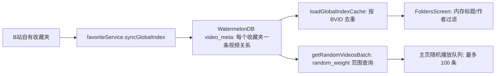

# 全局索引支持随机播放与搜索方案评估

## 1. 背景与评估范围

当前项目通过收藏夹本地索引支持主页全局搜索和随机播放。本文先记录源码与官方技术资料评估，再记录本次按评估结论完成的代码优化。实现保留 WatermelonDB schema，没有新增依赖或数据库迁移；Android 设备性能尚未测量。

重点检查索引的持久化形态、搜索/随机播放读取路径、去重、隐藏收藏夹和账号切换边界。运行时耗时结论均待真机和真实数据验证。

## 2. 修改前实现与调用链

`video_meta` 当前按“收藏夹 × 视频”保存记录。同步时 `upsertVideosBatch` 按 `playlist_id + video_id` 查找/写入，并只在新建行时生成 `random_weight`。启动/同步后 `loadGlobalIndexCache` 读取有效行，以 BVID 去重并合并 `folderIds`，放入进程内 `globalIndexCache`。

这里的“全局”实际是**已同步的 B 站自有收藏夹**：主页同时展示的他人收藏夹和订阅合集由导入来源 store 管理，没有合并进 `favoriteService.getGlobalIndex()` 的候选集。

关键代码位置：

- `src/services/favoriteService.ts:40-83`：内存索引缓存及 DB 行按 BVID 去重。
- `src/services/favoriteService.ts:249-262`：全量同步只处理传入 `hiddenFolderIds` 之外的收藏夹。
- `src/services/favoriteService.ts:431-460`：同步返回全局缓存；全局随机实际委托 DB 查询。
- `src/db/operations.ts:8-63`：以收藏夹和 BVID 作为关系行查找条件，新建时写入静态随机权重。
- `src/db/operations.ts:265-325`：内存索引数据源和随机权重查询/回绕逻辑。
- `src/screens/FoldersScreen.tsx:113-124`：全局搜索在 React render 中对内存索引执行标题/作者子串过滤。
- `src/screens/FoldersScreen.tsx:186-213`：主页全局随机播放取 100 条并建立播放队列。
- `src/db/schema.ts:23-40`：索引表字段和数据库索引定义；数据库适配器为 SQLite（`src/db/database.ts:11-23`）。
- `src/App.tsx:166-218`：账号变化时清理本地索引；隐藏偏好变化时只重载 DB 缓存。

## 3. 修改前确认的问题与限制

### 3.1 搜索与随机播放使用的候选集不一致

搜索的 `loadGlobalIndexCache` 会按 BVID 去重；随机播放则从 `video_meta` 逐行查询。由于同一 BVID 可在多个收藏夹中各有一行（`upsertVideosBatch` 的查找条件包含 `playlist_id`），全局随机查询没有对首批结果去重，可能把同一视频放入队列多次。回绕补充阶段只和已有结果去重，无法消除首批内部的重复。

### 3.2 随机权重是静态顺序，不是每次播放的均匀抽样

`random_weight` 只在插入新关系行时赋随机值，后续播放不重抽。每次随机播放从一个随机阈值开始，按固定权重升序拿一段，再从头回绕补齐。这相当于固定环形顺序上的连续片段；同一 BVID 的不同收藏夹关系还会拥有独立权重。索引可帮助范围/排序查询，但固定权重不保证每次从去重后的曲库均匀无放回抽样。

因此 `getRandomVideos` 注释中的“O(1)”不能由源码证明。SQLite 查询是否利用索引、实际耗时和查询计划，需要在目标数据量上测量；SQLite 官方资料也说明索引能帮助查找/排序，但优化效果取决于实际查询与执行计划。

### 3.3 隐藏收藏夹只影响后续同步，不影响已落库快照

`syncGlobalIndex` 会从待同步收藏夹列表中过滤隐藏目录；但 `loadGlobalIndexCache` 只按 `is_deleted = false` 读取全部关系行。`App.tsx` 检测隐藏设置变化时只调用 `loadGlobalIndexCache()`，没有传入隐藏 ID 或重建可见候选集。因此已同步后再隐藏的收藏夹仍可能出现在全局搜索和全局随机结果中。

现有设置和同步注释倾向于“隐藏收藏夹不进入全局索引”的语义，但“隐藏是否也应排除在随机播放之外”仍需产品确认。

### 3.4 搜索是完整内存扫描，尚无文本索引

主页搜索每次 render 都遍历 `globalIndex` 并对标题/作者执行大小写归一和 `includes`。FlatList 虚拟化了结果项渲染，但不会减少前置过滤扫描。当前没有为标题或作者建立 SQLite 全文索引；现有随机权重索引与搜索无关。

源码只能确认扫描路径，不能确认它已成为用户可感知瓶颈。当前没有真实曲库规模、目标设备耗时或搜索 p95 数据。

### 3.5 本地账号隔离依赖应用层清理

`video_meta` 行没有 UID 列；`App.tsx` 在检测账号变化或登出时清空索引。当前索引隔离因此依赖该清理流程成功执行，而不是查询条件中的账号边界。暂未发现本次问题之外的真实账号串用证据。

## 4. 方案比较

| 方案 | 适用范围 | 优点 | 代价/风险 | 结论 |
|---|---|---|---|---|
| 保留 WatermelonDB + 唯一内存曲库快照 | 当前规模未知、主页需要离线搜索 | 改动小；复用现有同步和 DB；搜索与随机可共享 BVID 去重和可见性规则 | 每次全局缓存构建仍会读入全部有效关系行；完整列表常驻内存 | **近期推荐**，先修正确性并测量 |
| 将曲库正规化为唯一 `video` 表 + `playlist_video` 关系表 | 关系行重复和多类查询已成为结构性问题 | 视频元数据只存一次；随机/搜索天然以唯一 BVID 为对象；收藏时间等关系属性仍放在关联表 | schema migration、旧数据去重、同步写入和软删除流程都要改；复杂度高 | 作为长期演进方案，先由规模/维护成本驱动 |
| SQLite FTS5 | 搜索测量确认内存扫描或数据集规模不可接受，且产品需要全文/词项匹配 | SQLite 提供数据库内全文词项查询和相关度能力 | 默认词项/前缀语义不同于当前任意子串匹配；中文分词和 Android/iOS SQLite 编译支持需验证；增加索引维护和迁移成本 | 暂不直接引入；不是 `.includes` 的无损替换 |

WatermelonDB 官方文档提供 DB 查询和 `Q.unsafeSqlQuery` 能力，但也明确原始 SQL 属于高级逃生口，JOIN 表、软删除过滤和参数绑定需要自行处理。WatermelonDB schema 文档说明普通索引会增加写入成本和数据库体积，应只为经常使用的查询建立。SQLite FTS5 支持词项、短语、前缀等全文查询；不能据此假设其保持当前子串搜索语义。参考：

- [WatermelonDB Query API](https://watermelondb.dev/docs/Query)
- [WatermelonDB Schema 与索引](https://watermelondb.dev/docs/Schema)
- [WatermelonDB Migrations](https://watermelondb.dev/docs/Advanced/Migrations)
- [SQLite FTS5](https://www.sqlite.org/fts5.html)
- [SQLite Query Planning](https://www.sqlite.org/queryplanner.html)
- [WatermelonDB 官方仓库与变更记录](https://github.com/Nozbe/WatermelonDB)

## 5. 实施方案与后续改进

### 已实施：统一全局候选集

1. `favoriteService.getGlobalIndex(hiddenFolderIds)` 从去重后的内存快照生成可见曲库投影；视频只要还属于一个可见收藏夹就保留。投影按快照引用和隐藏目录集合缓存。
2. 主页搜索与全局随机都使用相同的可见曲库投影。全局随机使用 Floyd 无放回抽样，额外索引空间与返回数量成正比，单批最多 100 个 BVID 不会重复。
3. 隐藏偏好改变时，主页依据 Zustand 更新直接切换投影；移除了 App 层为此重新读取全部 `video_meta` 的副作用。
4. 搜索将 query 统一 trim/lowercase，并 memoize 过滤结果；FlatList 保持既有虚拟化。
5. 单收藏夹随机仍保留现有 `random_weight` DB 路径；全局随机不再依赖每个收藏夹关系行的静态权重。增量缓存合并使用 BVID→数组位置的 Map，并替换数组引用，避免逐条 `find` 扫描，也让基于快照引用的缓存失效可见。

### 后续：测量后再决定 DB 重构

如果真机测量显示缓存构建时间、内存或搜索延迟不可接受，再评估把 `video_meta` 拆为唯一视频实体和收藏夹关系表。只有当产品接受词项/前缀匹配或找到合适的中文 tokenizer，且 iOS/Android 实际 SQLite 构建均支持时，才考虑 FTS5。

## 6. 验证方案与当前结果

本次执行 `git diff --check` 通过。对本次相关的 `FoldersScreen.tsx` 和 `favoriteService.ts` 执行 ESLint 时关闭仓库既有的 Prettier、unused-vars 与 trailing-space 规则后为 0 errors、41 warnings；warnings 是文件中已有的 React Native inline style/curly 等规则提示。标准 lint 无法作为通过依据：仓库配置对现有文件报告大量格式和未使用变量错误。

`tsc --noEmit` 未通过，报错仅出现在未修改的 `src/store/folderDataStore.ts:136`（`number | null` 类型不匹配）和历史备份 `trackPlayer_backup.ts`（路径失效的 imports 与 implicit any）。本次未运行测试、未连接 Android 设备，也未读取真实曲库数据库，因此没有延迟、内存或随机分布的实测数据。

实施后建议用相同 fixture 和至少一台低端/中端 Android 设备记录：

- N 条关系记录、去重后 BVID 数、启动加载 DB→缓存的耗时与峰值内存；
- 标题/作者查询的 p50、p95（短词、无命中、命中多结果）；
- 100 条全局随机抽样耗时、重复 BVID 数，以及多次取样的覆盖与分布；
- 隐藏/恢复收藏夹、账号切换、同步新增/软删除后，搜索和随机候选集是否一致；
- 若继续 DB 随机查询，采集 SQLite `EXPLAIN QUERY PLAN` 结果，确认实际索引利用和临时排序。

## 7. 最终结论

本次已让全局搜索和随机播放共享按 BVID 去重、受隐藏收藏夹过滤的曲库快照，并将全局随机改为无放回抽样。当前实现仍依赖应用层在账号切换时清理本地索引；单收藏夹随机仍使用静态 `random_weight`。是否继续正规化 DB 或增加全文索引，应由真实曲库和设备基准决定。

待确认：全局随机是否要求跨队列或跨启动不重复；当前只保证单次生成的随机批次内不重复。
