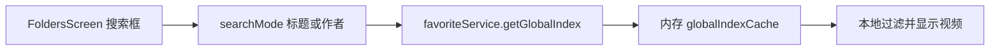
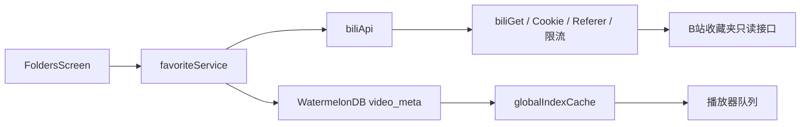

# B站在线视频搜索、收藏同步与个性化找歌可行性评估

## 1. 背景与目标

评估两项拟新增能力：

1. 在主页现有搜索框增加 B 站在线视频搜索，可按视频名称或 tag 搜索，并收藏到用户指定的已有收藏夹或新建的收藏夹，使结果与 B 站账号收藏保持一致。
2. 根据用户自己的收藏夹视频 tag 建立兴趣画像，提供“寻找新歌”入口，到 B 站检索相近视频，并尽量排除已收藏内容。

本评估基于截至 2026-09-27 的源码和公开资料。没有调用真实账号接口，也没有执行代码修改或测试；B 站网页端接口的实际可用性仍需登录账号验证。

## 2. 可行性结论

| 功能 | 代码实现可行性 | B站接口风险 | 主要限制 |
| --- | --- | --- | --- |
| 在线搜索、按名称/tag筛选、收藏或新建收藏夹 | 高 | 中到高 | 搜索与收藏写入使用网页端接口，不属于已确认稳定的官方开放 API；请求可能受 WBI、Cookie、CSRF 和风控影响 |
| 读取收藏 tag 并做个性化找歌 | 中 | 中到高 | 收藏视频列表不带 tag；需要逐视频补取并缓存，本地全局索引不保证覆盖全部远端自有收藏夹 |

**建议分两期实施。** 第一期先做在线搜索、目标收藏夹选择/新建和收藏结果回读。第二期在收藏 tag 可增量缓存、画像覆盖范围和“已收藏”校验语义明确后，再做找歌推荐。推荐初版可用本地规则，不需要新增服务端或机器学习依赖。

当前最适合项目的技术路线是沿用本机已保存的 B 站网页登录 Cookie，扩展现有 API service。它最贴合项目已有 Cookie、WBI、Referer、限流和收藏夹服务；代价是依赖非官方网页接口，需要针对 412 风控、接口变更和登录 Cookie 缺项设计降级。

## 3. 当前实现与调用链

### 3.1 当前搜索

主页搜索实现在 `src/screens/FoldersScreen.tsx`：

- 搜索模式是 `title | author`，分别匹配视频标题和 UP 主名称（约第 79-81、114-125 行）。
- 搜索源是 `favoriteService.getGlobalIndex()` 返回的本地数组，不发起 B 站搜索请求（约第 114-125 行）。
- 搜索框按钮只在标题和作者模式间切换（约第 255-267 行）。
- 多选状态来自 `selectionStore.selectedIds`，主页目前将它用于混合播放自有收藏夹；外部收藏来源在该模式下不可选（`src/screens/FoldersScreen.tsx` 约第 60、68、489-527、579-606 行）。因此它不是专门的“收藏目标文件夹”状态。

当前本地搜索链路：



### 3.2 当前 B 站和本地数据能力

- `src/services/biliApi.ts` 已读取自有收藏夹、收藏夹视频、他人收藏/合集，也可按 BVID 获取视频信息及播放地址；没有搜索、创建收藏夹或收藏视频写入方法（约第 24-133 行）。
- `src/core/wbi.ts` 已实现 WBI 密钥获取与参数签名，`src/core/http.ts` 已统一注入 Cookie、User-Agent、Referer、限流和错误处理（约第 18-47、71 行；`src/core/wbi.ts` 约第 15-66 行）。当前公共 helper 是 `biliGet`，没有通用表单 POST helper。
- `src/services/cookieService.ts` 把完整 Cookie 存进 Keychain；`bili_jct` 名称已在 `src/config/bilibiliAuth.ts` 定义，且登录 WebView 会合并主站与 Passport 返回的 Cookie。当前登录校验主要检查 SESSDATA 和 UID，没有校验写请求需要的 CSRF 值或搜索可能需要的 buvid3。
- 全局索引由 `favoriteService.syncGlobalIndex` 从 B 站拉取自有收藏夹条目并写入 WatermelonDB。每次同步会排除 `hiddenFolderIds`，但已隐藏收藏夹的历史 DB 记录不一定会被删除；因此当前索引受同步历史影响，不能保证覆盖全部远端自有收藏，也可能包含已隐藏目录的旧记录。导入的他人收藏夹与合集走独立 store。
- 当前 `FavoriteVideo` 没有 tag 字段。`video_meta` schema 为 v3，包含可选 `extra_json`；该字段目前被用来保存分P信息，不能直接把 tag 数组当分P数组读取。修改持久化格式需兼容旧数据，或新增列/表并升级 WatermelonDB schema。
- 播放链路以 BVID 为入口，`audioService.getInfo` 会继续请求视频信息与播放地址。搜索结果可通过适配器转成播放器使用的领域对象；无可用音频的视频仍可能由现有播放服务拒绝。

### 3.3 项目边界

- **项目目的与技术栈：**Nyami 是 React Native Android B 站纯音频播放器；项目依赖 React Native 0.74.5、TypeScript 5、WatermelonDB、MMKV、Keychain、Axios 和 Track Player（`README.md`、`package.json`）。
- **入口与调用边界：**导航入口在 `src/App.tsx`；主页搜索页面为 `FoldersScreen`。UI 通过 `favoriteService`/`biliApi` 读 B 站数据，`core/http` 注入认证并归一化业务码，本地数据通过 `db/operations` 访问 WatermelonDB。
- **持久化：**Cookie 与 refresh token 在 Keychain；设置/偏好在 MMKV；收藏夹索引与同步任务在 WatermelonDB。当前未发现服务端画像存储或推荐服务。
- **外部服务：**B 站网页/API 服务是本功能唯一新增数据依赖；无须为规则型画像引入第三方推荐 SDK。
- **验证入口：**`package.json` 声明 `npm test`（Jest）、`npm run lint` 和 `npm run android`；现有测试位于 `__tests__/`。本次只做源码/文档评估，未运行这些命令。

### 3.4 收藏夹同步链路



已有的 `favoriteService.invalidateFolder`、`syncSingleFolder` 和 `invalidateFolderList` 可用于收藏写入成功后清缓存、回读远端结果并更新本地索引（`src/services/favoriteService.ts` 约第 105-168、181-247、434-467 行）。

## 4. 需求拆分与边界

### 功能需求

- **FR-1 在线搜索：**保留现有本地标题/UP主搜索，新增明确的 B 站在线模式；支持视频标题与 tag 搜索、分页、加载态、取消过期请求和错误重试。
- **FR-2 收藏写入：**用户在搜索结果上选择一个或多个自己创建的 B 站收藏夹，或先新建收藏夹，再把该视频收藏进去。
- **FR-3 平台同步：**写入成功后以 B 站返回结果为准刷新收藏夹目录/视频列表；更新本地缓存，避免页面和推荐画像仍显示旧状态。
- **FR-4 个性化画像：**从当前账号自有收藏夹视频的 tag 统计兴趣权重，并用高权重 tag 到 B 站搜索候选视频。
- **FR-5 去重：**优先排除已收藏的视频。需要区分“本地已同步数据中没有”与“已确认不在 B 站任何自有收藏夹中”。
- **FR-6 播放：**推荐候选需适配现有 BVID 播放链路；界面应说明推荐理由，例如命中的兴趣 tag。

### 可验证的验收条件

- **AC-1（FR-1）：**输入标题关键词时，结果按标题命中展示；输入 tag 关键词时，只展示返回 tag 匹配的结果；翻页后不重复显示 BVID。B 站拒绝/限流时显示可理解错误，不把失败伪装成“无结果”。
- **AC-2（FR-2、FR-3）：**选择一个现有收藏夹后收藏成功，重新读取该 B 站收藏夹能找到该视频；新建收藏夹后它出现在选择器和主页目录；重复添加显示“已收藏”，不重复插入本地索引。
- **AC-3（FR-2）：**缺少 SESSDATA、bili_jct、当前 UID 与目标文件夹 UID 不匹配时，不发送收藏写请求，并显示可执行的登录/选择提示。
- **AC-4（FR-4、FR-6）：**找歌候选显示至少一个命中画像的 tag；本地已知收藏的视频不出现在推荐列表；账号切换后不复用上一个账号的画像和缓存。
- **AC-5（FR-5）：**只有远端回查确认或完整的本地同步范围才能标记“未收藏”；当只检查本地索引时，界面/文档使用“尽量避开本地已知收藏”的语义。

### 需要明确的产品语义

- “已勾选的收藏夹”是否指当前用于混合播放的主页勾选状态。当前这个状态用于组播放队列，不代表写入目标；建议收藏操作使用独立目标选择器，避免把播放选择误认为远端写入授权。
- 新建收藏夹的公开/私密默认值未定义。接口文档记录默认公开；如果产品希望默认私密，需要显式传 privacy=1 并在 UI 展示当前选择。
- “新歌”更可能表示“用户以前没收藏过的歌”，而非“最近投稿的视频”。推荐筛选需确认音乐分类、时长范围、封面/质量条件是否需要。
- 个性化画像是针对全部自有收藏夹，还是只针对当前已同步/可见的收藏夹，尚未定义。

## 5. 外部接口与方案比较

### 5.1 可用的接口线索

下列接口来自社区维护的 B 站网页端 API 资料，**不是 B 站官方稳定契约**：

| 能力 | 接口线索 | 对实现的意义 |
| --- | --- | --- |
| 视频分类搜索 | GET `/x/web-interface/wbi/search/type`，search_type=video、keyword、page；社区资料列出 WBI 签名、buvid3 Cookie、B 站 Referer 与 User-Agent 要求 | 现有 `encWbi/getWbiKeys` 和 http 配置可复用。每页约 20 条，结果含 BVID、标题、封面、tag；`hit_columns` 可标出 title/tag 等匹配字段。 |
| 自有收藏夹 | GET `/x/v3/fav/folder/created/list-all` | 项目已有读取封装，可用于目标选择器和创建后刷新。资料还记载带 `type=2&rid=aid` 可返回各收藏夹的 `fav_state`，可用于逐候选检查是否已经收藏。 |
| 新建收藏夹 | POST `/x/v3/fav/folder/add`，表单包含 title、intro、privacy；Cookie 模式需要 csrf | 需增加 POST 请求封装、CSRF 提取/校验和新建后的目录刷新。 |
| 收藏视频 | POST `/x/v3/fav/resource/deal`，表单包含 rid=稿件 avid、type=2、add_media_ids 和 csrf | 搜索结果提供 aid 时无需额外换算；如果缺失，需调用视频详情接口。社区资料列出重复收藏、权限不足、收藏上限等错误码。 |
| 视频 tag | GET `/x/tag/archive/tags?bvid=...` | 可为收藏画像补 tag；资料没有批量查询契约，因此按单视频接口估算，必须缓存并限速。 |

搜索接口结果结构与 tag/hit_columns 说明见[社区搜索请求资料](https://github.com/pskdje/bilibili-API-collect/blob/main/docs/search/search_request.md)和[响应字段资料](https://github.com/pskdje/bilibili-API-collect/blob/main/docs/search/search_response.md)。收藏夹新建说明见[收藏夹操作资料](https://github.com/pskdje/bilibili-API-collect/blob/main/docs/fav/action.md)，收藏视频说明见[稿件收藏操作资料](https://github.com/pskdje/bilibili-API-collect/blob/main/docs/video/action.md)，tag 接口资料见[视频 TAG 文档](https://sessionhu.github.io/bilibili-API-collect/docs/video/tags.html)。

### 5.2 候选路线

| 路线 | 优点 | 限制 | 结论 |
| --- | --- | --- | --- |
| B 站官方开放平台 API | 正式授权和开发者文档路径 | 官方目录描述了账号授权、用户数据等能力，但本次没有找到可确认覆盖“全站视频搜索 + 创建收藏夹/收藏稿件”的官方 API 契约。项目现有登录评估文档也记录当时无法取得开放平台应用资质；若该约束仍在，不能作为首期依赖。 | 有资质且官方 API 覆盖目标后再评估；先不推荐。 |
| 当前网页登录 Cookie + 网页端接口 | 复用现有账号 Cookie、WBI、Referer、收藏夹列表、Keychain 和请求限流；可满足搜索与平台收藏写入 | 接口非官方、文档已归档、字段可能变更；搜索和写入可能触发 412/CSRF/账号异常，必须保守限速并处理错误。 | **当前仓库最匹配，建议实现时采用。** |
| WebView 打开 B 站页面，由用户手工搜索/收藏 | 使用官方页面交互，不需要 app 自行维护写接口参数 | 结果无法可靠回流到本地列表；自动化点击脆弱；分页/tag 筛选和推荐难与 RN 页面整合。 | 可作为接口失效时的人工回退链接，不适合作为主实现。 |

社区 API 收集仓库明确将内容称为“野生 API”，声明不属于官方开放平台；该仓库于 2026-01-28 归档，主分支同步点为 2026-01-24/25，并自述部分文档可能较旧。它适合定位接口，不适合当成稳定性承诺。[仓库说明与归档状态](https://github.com/pskdje/bilibili-API-collect)

社区客户端 [public-clis/bilibili-cli](https://github.com/public-clis/bilibili-cli) 仍展示视频搜索能力，并提醒升级以适应上游 API 变化；这说明社区集成路径仍在使用，但不构成 B 站官方支持或写接口长期兼容的证明。

## 6. 推荐设计

### 6.1 在线搜索与收藏

1. 在当前本地搜索上增加第三个“B站在线”模式；保留本地标题/UP主搜索语义，避免把在线搜索结果混入 WatermelonDB 全局索引。
2. 新增独立的搜索结果类型，保存 aid、bvid、标题、封面、时长、tag 和匹配字段。搜索以用户提交/防抖为触发点，使用 WBI 签名、已有 Referer 和限流器；分页请求支持 AbortSignal，避免旧关键词响应覆盖新结果。
3. 搜索 API 只有 keyword 参数，没有可靠的 title-only/tag-only 服务端过滤字段。可把 query 发给 B 站，再按结果 hit_columns 与返回 tag 做本地筛选；标题模式检查 title 命中，tag 模式检查 tag 命中。筛选后不足一页时，在请求预算内继续拉页。
4. 收藏按钮打开专门的目标收藏夹选择器：只允许当前 UID 创建的收藏夹；支持多选和新建。现有主页 `selectedIds` 是混合播放选择，不建议直接把它复用成收藏目标状态。
5. 收藏写入前确认仍是同一登录 UID，并校验 `bili_jct` 存在；API 层统一表单编码、Referer、业务码映射和日志脱敏。不要记录 Cookie、CSRF 或原始登录头。
6. 写入成功后失效收藏夹/视频缓存，刷新 B 站目录，并按目标文件夹调用现有单收藏夹增量同步。若远端返回重复收藏，按“已在收藏夹”呈现，不作为致命错误。

### 6.2 个性化找歌

1. 画像只使用当前 B 站账号创建的收藏夹；不混入已收藏他人收藏夹/合集，除非产品另行决定。
2. 先读取已有本地自有收藏视频，再通过视频 tag 接口增量补全 tag 并缓存。不要在用户每次点击时对所有历史视频重新请求。
3. 画像可先用可解释的规则：按 tag 计数，并可对近期收藏加权；取前若干兴趣 tag 分别发起有限页搜索。推荐理由展示命中的 tag，便于用户判断相关性。
4. 搜索结果含 tag，可按 tag 重合度初排，再用 B 站搜索排序作为次级排序。仅搜索音乐分区或限制时长等过滤需另行验证分类参数与产品语义。
5. 去重先用本地 BVID 索引快速排除；若要求确认“B 站全部自有收藏夹均未收藏”，可验证社区文档记载的 `created/list-all?type=2&rid=aid` 与 `fav_state`，逐候选回查。该方式仍是非官方接口且每个候选增加一次远端请求。
6. 只使用本地索引时，推荐必须标记为“尽量避开本地已知收藏”；不能承诺用户未同步或刚刚远端收藏的视频都已被排除。本地索引可能仍留有已隐藏目录的历史记录。账号切换时清空画像、tag 缓存和候选结果。

由于当前 rate limiter 上限为每秒约 1 个请求，逐条补取 tag 可能造成首次画像构建缓慢。推荐使用后台分批、缓存、可中断进度；不能把所有 tag 拉取放在搜索按钮的同步等待链路中。现有 WatermelonDB schema 为 v3，建议用新增 tag 列/表并配套 migration；不要复用当前被解析为分P数组的 extra_json，除非先做带版本兼容的格式迁移。

## 7. 影响面

| 文件/模块 | 预计变化 | 原因 |
| --- | --- | --- |
| `src/screens/FoldersScreen.tsx` | 修改 | 增加在线搜索模式、结果态、按标题/tag筛选和找歌入口。 |
| `src/services/biliApi.ts`、`src/types/bili.ts` | 修改 | 增加视频搜索、收藏夹创建、收藏写入、逐候选收藏状态与视频 tag 的类型化调用。 |
| `src/core/http.ts` | 修改 | 为 POST 请求复用 Cookie、限流、超时、错误映射；现状只有 biliGet helper。 |
| `src/services/cookieService.ts`、`src/config/bilibiliAuth.ts` | 修改 | 提供受控的 CSRF/buvid3 读取与缺失错误；凭证仍留在 Keychain，禁止日志输出。 |
| `src/services/favoriteService.ts` | 修改 | 复用目标收藏夹列表缓存、成功后的缓存失效、本地增量同步；建立 tag 画像输入。 |
| `src/types/domain.ts` 或新搜索类型 | 修改 | 将远端搜索结果与已收藏领域对象分离，明确 BVID/AID/tag 与播放所需字段映射。 |
| `src/db/schema.ts`、`src/db/migrations.ts`、模型与 DB operations | 可能修改 | 若 tag 画像要跨启动复用，增加 tag 持久化并升级 schema；需兼容现有分P extra_json。 |
| `src/store/selectionStore.ts` 或新 store | 修改 | 提供独立的收藏目标选择状态，避免复用混合播放选择。 |
| `__tests__` | 后续新增 | 覆盖 WBI 搜索映射、title/tag 匹配、CSRF 缺失、重复收藏、目录创建后回读、画像去重和账号切换。 |

## 8. 风险、验证与待确认事项

### 风险

- **高：网页端接口不稳定。** 搜索 WBI、收藏写入及候选收藏状态都来自非官方资料；需要清晰的 412/CSRF/业务码提示、低并发、取消请求和人工重试。
- **高：收藏是远端副作用。** 写入前应显示视频和目标收藏夹，UID 变化时中止；成功以 B 站响应/回读为准，不能只改本地缓存。
- **中：Cookie 字段并非必然齐全。** 现有登录校验不保证 bili_jct 与 buvid3；需在搜索/写入前分别校验实际接口要求，缺项时说明重新登录或刷新会话。
- **中高：画像冷启动与覆盖范围。** 收藏列表不含 tag，逐视频获取会被每秒约 1 次的全局限流约束；本地 global index 不保证覆盖全部远端收藏，且可能保留已隐藏目录的历史记录。
- **中：未收藏语义。** 本地无 BVID 不等于 B 站账号没收藏；精确回查会增加请求并继续依赖非官方状态字段。
- **中：候选不一定是音乐。** 视频搜索可能返回与兴趣 tag 有关但不适合纯音频播放的内容；“新歌”筛选条件需产品定义。

### 后续验证计划

实现前用一个可控 B 站账号确认：WBI 搜索是否要求已存 Cookie 中的 buvid3、当前签名字段与每页结构；title/tag 匹配字段；搜索触发 412 时的恢复行为；创建私密/公开收藏夹后 id 与权限；同一个视频收藏到一个和多个文件夹；重复收藏和达到上限的错误码；`fav_state` 是否能准确覆盖所有自有文件夹。写操作验证应使用专门测试收藏夹及可删除的测试视频。

实现后再验证：收藏状态能否在 B 站网页和应用中互相看到；新视频是否进入本地索引；画像 tag 是否缓存并随账号隔离；已有收藏去重；快速切换关键词不会展示旧结果；取消搜索不会继续消耗分页请求。

### 待确认

1. “已经勾选的收藏夹”是否明确指混合播放中选择的文件夹，还是需要新的默认收藏目标配置？
2. 新建收藏夹默认公开还是私密？
3. 兴趣画像按全部自有收藏夹生成，还是仅使用可见/已同步收藏夹？
4. “寻找新歌”是否要求 B 站音乐分区、时长范围、已收藏于任何文件夹的候选都必须绝对排除？
5. 当前项目是否仍无法申请 B 站开放平台应用资质？既有登录可行性文档记录了这一约束（`doc/auth/bilibili/2026-09-26-手机唤起登录可行性分析.md` 第 48-70 行）。

## 9. 最终建议

在线搜索和收藏同步可以基于当前架构实现，主要新增 API wrapper、CSRF 保护和搜索 UI；本地播放、Cookie 安全存储、WBI、速率限制、收藏夹读取、缓存失效和 WatermelonDB 增量同步都可复用。需要把“未收藏”表述控制在当前可核验的账号数据范围内。

个性化找歌也可实现，但不是简单复用现有本地搜索：需要建立收藏视频 tag 的持久缓存、定义画像覆盖范围、增加远端搜索与去重回查，并处理慢速冷启动。建议先落地在线搜索/收藏，再积累 tag 缓存，最后开放推荐。

外部来源：

- [B站开放平台文档目录](https://open.bilibili.com/doc)
- [社区搜索接口资料](https://github.com/pskdje/bilibili-API-collect/blob/main/docs/search/search_request.md)与[结果字段资料](https://github.com/pskdje/bilibili-API-collect/blob/main/docs/search/search_response.md)
- [社区收藏夹创建资料](https://github.com/pskdje/bilibili-API-collect/blob/main/docs/fav/action.md)、[收藏视频资料](https://github.com/pskdje/bilibili-API-collect/blob/main/docs/video/action.md)和[视频 tag 资料](https://sessionhu.github.io/bilibili-API-collect/docs/video/tags.html)
- [社区 API 仓库归档声明](https://github.com/pskdje/bilibili-API-collect)
- [仍提供 B 站视频搜索的社区 CLI](https://github.com/public-clis/bilibili-cli)

## 10. 本轮实施计划与接口复核（2026-09-27）

### 已复核的公开协议

- 社区接口资料将视频分类搜索列为 `GET /x/web-interface/wbi/search/type`，每页 20 项，响应视频项包含 `aid`、`bvid`、`title`、`tag`、`pic`、`duration`；资料说明 WBI 签名与 Cookie 鉴权。来源：[bili-apis 搜索协议](https://github.com/realysy/bili-apis/blob/master/docs/search/search_request.md)。
- 收藏夹新建使用表单 POST `/x/v3/fav/folder/add`，可传 `title`、`intro`、`privacy`、`csrf`；`privacy=1` 表示私密。来源：[收藏夹操作协议](https://github.com/pskdje/bilibili-API-collect/blob/main/docs/fav/action.md)。
- 视频收藏使用表单 POST `/x/v3/fav/resource/deal`，传 `rid=aid`、`type=2`、逗号分隔的 `add_media_ids` 与 `csrf`；重复收藏可能返回 `11201`。写入后可通过 `created/list-all?up_mid=...&type=2&rid=...` 读取 `fav_state`（1 表示目标收藏夹含该视频）。来源：[收藏写入协议](https://github.com/pskdje/bilibili-API-collect/blob/main/docs/video/action.md)、[收藏夹状态协议](https://github.com/pskdje/bilibili-API-collect/blob/main/docs/fav/info.md)。
- 这些资料均为社区维护的网页端接口说明，不是 B 站稳定性承诺；线上账号行为仍需设备实测。

### 实施顺序

1. 在现有 `biliApi` / `biliGet`、Cookie、WBI 和速率限制基础上增加分类视频搜索与单次表单写入；写请求不自动重放，CSRF 与当前 UID 必须匹配。
2. 在主页搜索增加第三种在线模式，并提供名称/tag 过滤、分页、过期请求取消及空结果/错误态。
3. 为在线结果提供自有收藏夹目标选择器和新建收藏夹表单；新建默认私密且可显式切换公开。
4. 收藏写入后按 `aid` 回读远端 `fav_state`，只将远端确认的收藏夹写入 WatermelonDB 并刷新全局索引/收藏夹缓存。回读失败时展示“状态未确认”，不自动重发写请求。
5. 为搜索转换与筛选、收藏状态回读及本地索引更新增加可重复测试；执行项目测试、类型检查/构建与 Git 定向提交。真实 B 站账号写入不纳入自动测试。

## 11. 本次实际实施与验证（2026-09-27）

### 已实现

- 搜索框增加第三种 B 站在线模式，调用 WBI 视频搜索接口，支持按名称或搜索结果 tag 过滤，提供分页、请求取消和过期结果隔离。
- 搜索结果可以进入播放队列，也可以打开收藏目标选择器。选择器只展示当前账号自有收藏夹，允许多选；可以新建公开或私密收藏夹，新建默认私密并在 B 站回读确认后加入选项。
- 收藏写入前检查 Keychain Cookie 的 UID、SESSDATA 和 bili_jct，并在写入与回读前后校验账号归属。写操作使用一次性表单 POST，不自动重放。
- 写入后按 AID 读取 B 站收藏夹状态；仅把 `fav_state=1` 且归属当前账号的目录写入 WatermelonDB，并刷新收藏夹缓存与全局索引。远端只确认部分目录时保留逐目录结果；状态回读失败时不猜测成功，也不重发写请求。
- 本轮只实现在线搜索与收藏闭环。根据收藏 tag 建立画像并寻找尚未收藏视频仍属于后续阶段，需要设计 tag 缓存、冷启动与去重范围；本次没有声称该推荐功能已交付。

### 验证结果

- `npm test -- --runInBand __tests__/onlineSearchTransformers.test.ts __tests__/biliApiOnline.test.ts __tests__/favoriteWrite.test.ts`：3 个测试套件、12 个用例通过，覆盖 WBI 请求参数、名称/tag 匹配、凭证校验、收藏写入后状态回读、部分确认和本地索引更新。
- Android Metro release bundle：成功生成。
- 定向 ESLint：退出码 0（关闭仓库现有 Prettier 规则后检查实现文件）。
- `npx tsc --noEmit --pretty false`：未通过；诊断集中在既有 `src/store/folderDataStore.ts` 的 nullable 参数，以及归档文件 `trackPlayer_backup.ts` 的失效导入/隐式 any，本次修改文件没有报告类型错误。
- 全量 Jest：新增的 3 个套件通过；`App.test.tsx` 因测试运行环境未注册原生 `RNShare` 模块而无法加载，`sync.test.ts` 因 React Native FS 原生事件模块缺失而无法加载。尚未在真实 B 站账号和设备上执行写收藏的端到端验证。

### 未解决风险

当前搜索、收藏夹创建/写入及 `fav_state` 回读都依赖社区记录的 B 站网页端协议，接口可能变化；真实账号联调仍需使用专门测试收藏夹确认账号 Cookie、CSRF、业务码与多目录行为。自动测试仅使用 mock，不会更改真实账号数据。

## 12. 收藏标签画像能力的当前复核（2026-09-27）

### 结论

**可以作为后续功能实现，但当前版本还不能依据已收藏视频的 tag 生成画像或推荐歌曲。** 当前已实现的是：读取 B 站在线搜索响应中的 tag，用于搜索结果过滤和展示；收藏夹同步、收藏落库和推荐链路没有接入这些 tag。

### 代码证据

- 在线搜索响应类型含可选 `tag`，`trimSearchVideo` 将其拆成 `OnlineVideoSearchResult.tags`；`FoldersScreen` 可以按 tag 过滤并显示搜索结果标签（`src/types/bili.ts:18-28`、`src/services/transformers.ts:57-90`、`src/screens/FoldersScreen.tsx:213-249,667`）。这是当前已验证的标签数据入口。
- 收藏列表类型 `BiliFavoriteVideoMedia` 和领域类型 `FavoriteVideo` 都没有 tag 字段；`trimFavoriteVideo` 不读取 tag。用于搜索播放队列的 `searchVideoToFavoriteVideo` 也只映射普通视频字段（`src/types/bili.ts:75-88`、`src/types/domain.ts:37-49`、`src/services/transformers.ts:23-40,92-105`）。
- 在线搜索收藏写入路径会暂时将原始搜索对象的 tag 一并带到内存对象（`favoriteService.addSearchResultToFolders` 使用 `...video`），但 `upsertVideosBatch` 没有持久化 tag，且重载时从 WatermelonDB 重建 `FavoriteVideo` 只还原已有列；`video_meta.extra_json` 当前保存的是分P数组（`src/services/favoriteService.ts:365-434`、`src/db/schema.ts:24-38`、`src/db/operations.ts:8-55`）。因此本地收藏索引重载后无法由现有字段恢复 tag。
- `biliApi.getVideoInfo` 使用的视频详情类型也没有声明或处理 tag；源码搜索未发现按收藏视频批量取标签、画像聚合或找歌推荐模块（`src/services/biliApi.ts:167-190,224-232`、`src/types/bili.ts:98-107`）。

### 可行实现路径

1. 明确画像范围（全部自有收藏夹，或用户选择的收藏夹），按当前登录 UID 枚举来源；使用已实测可按 BVID 返回 `Tags` 的详情聚合接口增量补取并缓存标签，避免每次建画像都重扫。
2. 将标签元数据和分P数据分开存储，或为现有 `extra_json` 设计带版本的兼容结构；不要直接把 tag 数组写入当前分P数组字段。项目全局 API 速率配置为每秒 1 次、突发 2 次，若标签需要逐视频补取，首次冷启动耗时会随收藏数量线性增加（`src/config/index.ts:24-28`）。
3. 初版可用本地可解释规则（标签出现频次、收藏时间权重、通用噪声标签降权）形成偏好，再复用现有在线搜索按高权重 tag 找候选，并展示命中的推荐理由；无需先引入机器学习服务。
4. 推荐结果可排除本地已知收藏，但若要承诺“任何自有收藏夹都未收藏”，需针对候选回查 B 站收藏状态。本地同步只处理非隐藏目录，因而索引不能保证覆盖当前账号全部自有收藏夹；`video_meta` 行本身也不含账号 UID。应用的 `App.tsx` 当前会在 UID 变化和登出时清空全局索引，所以新增画像缓存应按 UID 隔离并接入同一清理生命周期，不能将无 UID 的 `getGlobalIndex()` 直接视为远端完整收藏集（`src/services/favoriteService.ts:141-158,460-472,648-658`、`src/db/schema.ts:24-38`、`src/App.tsx:163-182`）。

### 尚待验证

- 标签接口对私密、已删除、失效视频的处理，以及限流策略；本轮已确认公开视频可按 BVID 获取标签，但没有用当前账号收藏夹中的视频逐一验证访问覆盖率。
- 画像默认覆盖范围、用户是否可查看/重置画像，以及推荐候选是否限定音乐分区、时长或可正常播放的视频。
- 本节包含源码静态复核和公开视频样例接口实测；没有调用当前账号收藏夹接口，也没有运行测试或设备验证。

## 13. B 站标签接口的官方资料核查（2026-09-27）

### 已确认事实

- B 站官方开放平台公开入口将视频管理概括为稿件发布、删除和查询，并将部分数据开放能力描述为需要用户授权；公开入口没有给出“按任意 BVID 获取收藏视频标签”的具体接口、字段或权限说明：[B 站开放平台文档](https://open.bilibili.com/doc)。本轮按“视频标签 / 稿件标签 / archive tags”等词检索官方文档，没有找到该接口定义。
- 当前项目能确认的标签数据仍是在线搜索响应中的 `tag` 字段，代码已有 WBI 搜索接入；这只能证明搜索结果带 tag，不能证明可通过收藏视频 BVID 稳定回查 tag。
- 本轮在 B 站视频页上下文请求 `GET https://api.bilibili.com/x/web-interface/view/detail?bvid=BV1GJ411x7h7`，HTTP 状态为 200、业务码 `code=0`；响应 `data` 明确含 `View`、`Tags`、`Related` 等字段，`Related` 有 40 条，`Tags` 含 7 项。标签包括视频标题相关标签和 `Never Gonna Give You Up`、`Rick Astley`、`欧美MV`、`流行音乐`、`欧美音乐`、`MV`，与[示例视频页](https://www.bilibili.com/video/BV1GJ411x7h7/)展示的标签一致。
- 另请求标签专用接口 `GET https://api.bilibili.com/x/tag/archive/tags?bvid=BV1GJ411x7h7`，HTTP 状态为 200、业务码 `code=0`，响应 `data` 含 `tag_id` 和 `tag_name`，返回上述 6 个正式标签。
- 两个请求都显式设置 `credentials: 'omit'` 并成功，说明本次公开视频样例读取不依赖登录 Cookie。该验证只覆盖公开视频样例，不能外推到私密、失效或受限视频。

### 结论与不确定性

- **官方开放平台接口：仍未确认。** 公开官方资料未说明这一能力，因而不能将下面的网页接口描述为官方承诺稳定的开放 API。
- **网页端接口：已确认公开视频可用。** `GET /x/web-interface/view/detail?bvid=...` 的详情聚合响应直接包含 `Tags`，并同时包含 `Related`；`GET /x/tag/archive/tags?bvid=...` 也能单独返回标签 ID 与名称。可以用详情聚合接口按收藏视频 BVID 采集画像所需的标签。此结论针对实测的 `/view/detail`，不泛化为所有 `/view` 路径。
- 接口稳定性、频率限制、私密或失效视频行为以及真实收藏清单的覆盖情况仍待验证。本轮浏览器直接读取视频页和标签接口成功；先前检索代理的 412 只说明该代理请求受限，不影响本次浏览器接口响应证据。

### 接入结论及后续验证项

接口核查后的实际接入、代码位置和验证结果见第 14 节。

## 14. 收藏视频 tag 画像与音乐推荐接入（2026-09-27）

### 目标与范围

把已确认可用的 B 站网页端视频 tag 接口接入 BiliMusic：从本地已同步收藏视频按需读取 tag，形成设备本地兴趣画像，并使用画像在 B 站音乐分区搜索可播放候选。画像与缓存留在本机；采集时按视频向 B 站发送单个 BVID 查询，推荐时将兴趣 tag 作为搜索词，不会把完整收藏清单或聚合画像提交给其他服务。

### 实现链路

```mermaid
flowchart LR
  A[FoldersScreen 推荐入口] --> B[TagRecommendationsScreen]
  B --> C[本地已同步收藏索引]
  C --> D[/x/tag/archive/tags 按 BVID 读取]
  D --> E[video_tag_cache 本地缓存]
  E --> F[按标签覆盖度计算画像]
  F --> G[WBI 搜索音乐分区]
  G --> H[去重、排除本地收藏、按匹配度排序]
  H --> I[复用播放器播放推荐]
```

- `src/services/biliApi.ts` 新增轻量 tag 专用接口调用，使用共享 `biliGet`，继承已有 Cookie 注入、请求限速、错误映射和取消能力；详情聚合接口不纳入播放链路。
- `src/db/schema.ts` 与 `src/db/migrations.ts` 将 WatermelonDB 增至 v4，新增以 BVID 索引的 `video_tag_cache` 表。缓存 tag JSON、成功读取时间和失败重试时间；账号切换/退出复用现有 `clearAllData()` 清理逻辑，并在账号切换时先清理再恢复索引。
- `src/services/tagRecommendationService.ts` 仅对唯一、有效的本地收藏视频统计 tag 覆盖度；特殊 `tag_id=0` 不参与排序。画像偏好留在运行时计算，不单独持久化。
- 首次采集需逐条请求，页面提供进度；请求复用全局每秒 1 次限速，成功缓存 30 天，临时错误冷却 30 分钟，资源不可用冷却 24 小时。遇到鉴权、网络或限流错误会停止本轮后续搜索。离开页面会中断请求，已写入缓存保留，下次继续。
- 推荐只取画像前 5 个 tag，到音乐分区（`tid=3`）搜索；按 BVID 合并、排除本机已知收藏，并以匹配标签权重和发布时间排序，最多展示 30 条。点击条目复用现有队列与播放器解析流程。
- `src/screens/FoldersScreen.tsx` 增加入口；页面进入时仅读本地收藏和缓存，用户点击按钮后才回填 tag 和在线搜索，避免打开页面就发起网络请求。

### 风险与限制

- 标签专用网页接口未被官方开放平台文档承诺为稳定 API；若 B 站接口或权限策略变化，缓存未覆盖的视频采集会失败。
- 当前画像只覆盖本机已经同步且仍有效的收藏索引，不代表 B 站账号完整远端收藏清单。首次全量回填耗时与收藏视频数量线性相关，并受共享限速约束；采集是显式触发、可中断和续跑的。
- 推荐页会校验当前 UID 与本地索引 UID 一致后才读取数据，避免账号切换清理完成前显示上一个账号的索引。
- 推荐搜索使用在线搜索结果的 `tag` 字段筛选，候选召回与 B 站搜索排序有关；本机索引之外的视频可能仍被推荐。当前方案不保证全账号范围内排除已收藏视频。
- 播放能力沿用现有 B 站视频解析器；本轮没有在真实设备上验证播放器行为或 WatermelonDB v3 到 v4 的升级过程。

### 验证结果

- 本地 TypeScript 检查没有报告本次新增页面、服务、模型和 API 类型错误；命令仍因既有 `src/store/folderDataStore.ts:136` 的 `number | null` 类型错误及根目录 `trackPlayer_backup.ts` 的旧路径导入错误而失败。
- 新增页面、推荐服务和缓存模型单独运行 ESLint：0 个错误；有 React Native 行内样式规则警告。
- 修改文件的全量 ESLint 会触发仓库现存的 Prettier 格式和未使用变量问题，因此未对无关旧文件做全量格式化。
- 未运行测试，也未进行真实设备 / 原生数据库迁移验证。

### 结果

tag 采集、增量缓存、本地画像、音乐分区推荐和播放器入口已形成可用实现链路。后续可在真实设备抽样确认缓存迁移与接口覆盖率，并根据实际召回效果调整画像权重或音乐搜索策略。

## 15. Android 手机一键测试脚本（2026-09-27）

Windows 用户可在项目根目录连接已开启 USB 调试的 Android 手机，然后运行：

```powershell
npm run android:phone
```

该命令调用 `scripts/run-android-phone.ps1`，从 `android/local.properties` 读取 SDK 路径，检查 ADB 与 React Native CLI，确认手机已授权，并将设备的 Metro 端口 8081 转发到开发电脑。随后调用 React Native CLI 构建、安装调试版并启动 Metro。多台设备同时连接时，可运行 `npm run android:phone -- -DeviceId <序列号>` 指定目标设备。

脚本以带 BOM 的 UTF-8 保存，兼容 Windows PowerShell 5.1 对含中文脚本的读取方式；ADB 和 React Native CLI 运行期间将原生命令的 stderr 按诊断输出处理，并根据退出码判定成败，避免 ADB 首次启动时的正常提示中断脚本。

首次运行前仍需完成项目依赖、Android SDK 与 JDK 的安装；手机首次连接时需解锁并确认“允许 USB 调试”。安装启动后，在应用中同步全局索引，再从收藏列表的标签入口进入“收藏标签推荐”，点击“读取标签并生成推荐”。已用 Windows PowerShell 5.1 通过 npm 入口执行脚本，并以不存在的设备序列号确认其能完成解析和 ADB 枚举后给出预期提示；未执行 Android 构建、安装或真实手机联调。
