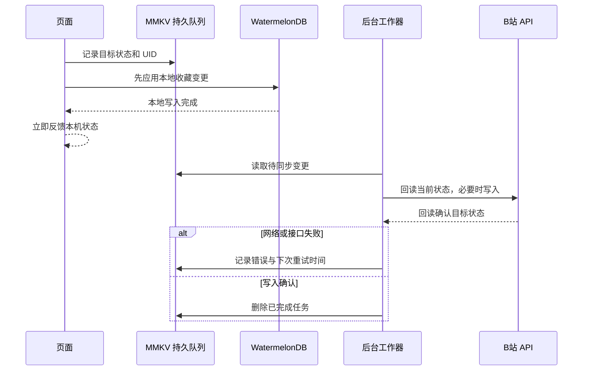

# B 站变更本地优先与后台重试

## 1. 背景与目标

创建收藏夹、收藏歌曲和取消收藏需要访问 B 站写接口。旧流程将远端请求和回读放在用户操作路径上，网络慢或失败时会延迟界面反馈，也无法可靠恢复进程退出期间未完成的变更。本次将本机状态设为操作入口，并把需要写回 B 站的目标状态持久化后异步处理，失败后按账号隔离重试。

## 2. 现状与行为边界

- 自有收藏夹创建通过 `favoriteService.createFavoriteFolder` 进入；歌曲添加和删除分别由收藏选择弹窗、播放页调用 `favoriteService.addSearchResultToFolders` 和 `favoriteService.removeVideoFromFavoriteFolder`。
- 首页推荐中的“订阅合集”表示把账号**已经在 B 站收藏/订阅**的外部来源加入本机主页索引。`SubscribePlaylistButton` 更新本地 `visibleSourceKeysByUid` 并触发视频索引同步；它不创建或取消 B 站原生合集订阅关系。主页播放列表偏好中的取消选择也只改变本机可见状态。
- 当前 B 站 API 层实现了自有收藏夹与视频收藏写入，没有本机合集订阅按钮所需的远端关注变更调用。本次保持已有语义，不把本机索引接入误报成 B 站远端订阅成功。

## 3. 方案与调用链

- 收藏/取消收藏先把“目标状态”写入 MMKV 队列，再幂等更新本地视频关系。队列任务按 UID、收藏夹和 BVID 定位；同一对象的快速连续操作递增 revision，以最后一次目标状态为准。
- 后台工作器先回读 `fav_state`，仅在远端状态不符时发起写请求，再回读确认。错误任务使用指数退避，最长间隔一小时；应用启动且账号恢复后继续处理。
- 新建收藏夹先显示本地负数临时 ID 的占位项。远端创建确认后保存临时 ID 到正式 ID 的别名，将临时收藏夹的视频关系、播放队列关系和本地偏好引用迁移到正式 ID。
- 即使创建 POST 已返回正式 ID，在本地关系迁移完成前仍显示临时目录的同步状态；避免用户提前打开正式目录却看到尚未迁移完成的空列表。
- 收藏夹创建 POST 不是天然幂等操作。每次 POST 前工作器都从 B 站刷新并保存目录基线；只有此前确实发起过结果不明确的 POST 时，才等待 60 秒并按“基线后新增且同名”的唯一候选确认，发现多个候选时继续等待，尽量避免超时重试造成重复创建或误认外部同名目录。
- 本机合集订阅更新可见来源后立即生效；`queueIndexSyncWithRetry` 以 UID 持久化索引同步意图，失败后退避重试。标签回填仍复用现有全局索引同步流程。

## 4. 核心修改

- `favoriteService` 增加收藏夹创建与歌曲收藏变更 outbox、UID 账号校验、任务合并、回读确认、重试计时器和应用恢复入口。
- 本地新建收藏夹以临时 ID 展示；待创建目录不参与 B 站索引同步。创建成功后迁移本地播放列表关系和收藏夹偏好 ID。
- 播放页取消收藏和收藏选择弹窗反馈本机操作状态；收藏到多个目录时批量写入后只重建一次全局索引快照。索引刷新会隔离早于本地数据库写入的在途读取。
- `syncStore` 增加持久化的全局索引同步重试意图；登录恢复时分别恢复收藏变更与索引同步队列。
- 索引重试器等待当前及已排队的同步结束后再启动，避免长同步期间的轮询反复排队，造成连续重复同步。
- WatermelonDB 仅新增临时播放列表关系迁移操作；没有新增数据库表或 schema migration。

## 5. 风险与影响范围

- B 站创建收藏夹没有幂等键。等待窗口和目录回读只能降低重复创建概率；若远端列表最终一致延迟超过窗口，或存在并发的同名目录创建，仍有重复或误匹配风险。
- 待处理写操作在账号切换时暂停，恢复原 UID 后继续；Cookie 归属会在写入前后复核。队列保存在本地 MMKV，不会跨账号执行。
- MMKV outbox 与 WatermelonDB 不是跨存储事务。任务先持久化，数据库写入使用幂等 upsert/软删除，并用 `localApplied` 标记支持崩溃恢复；本地数据写入失败时任务保留并重试。
- 现有 `__tests__/favoriteWrite.test.ts` 仍覆盖旧的同步远端确认契约，未随本次改造调整或执行；重新启用该测试文件前需要更新断言以覆盖本地优先和后台队列语义。
- 收藏夹列表在远端写入确认后更新回读快照。B 站网页端或其他设备的改动仍需用户手动刷新目录。
- 本机取消来源可见状态不等于取消 B 站原生合集订阅；若未来要改写 B 站关注关系，需要单独确认产品语义并接入相应远端接口和回读机制。

## 6. 验证

- 定向 ESLint（收藏服务、同步 Store、收藏弹窗、播放页和目录页面）：0 errors。
- 全量 `npx tsc --noEmit --pretty false` 被未修改的根目录 `trackPlayer_backup.ts` 中缺失模块引用及隐式 `any` 阻断；没有报告本次修改文件的诊断。
- `git diff --check`：通过。
- 未运行自动化测试、Android 构建或真机账号写入验证；远端接口行为和进程中断恢复仍需设备/账号场景验证。

## 7. 最终结果

实现本地优先的收藏夹创建与歌曲收藏变更，并持久化 B 站写入重试；外部合集操作继续按项目既有语义同步到本机索引。代码和本文档按单项变更提交。
