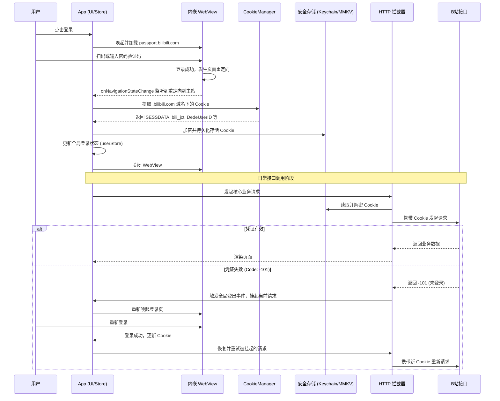

# B站登录授权与Cookie管理重构方案

为了提升数据获取的维度和系统安全性，本项目将从“手动输入Cookie”模式全面重构为“App内嵌WebView扫码/密码登录”模式。通过加载B站官方登录页，引导用户完成真实授权，并在本地安全地提取、加密存储核心鉴权凭证（Cookie），同时构建全局的凭证失效拦截与重试机制。

---

## 一、 整体业务流程架构



---

## 二、 前端 WebView 登录实现

### 1. 核心依赖
需要引入以下库来支持 WebView 和 Cookie 操作：
```bash
pnpm add react-native-webview @react-native-cookies/cookies react-native-keychain
```

### 2. WebView 组件设计 (`LoginModal.tsx` 或 `LoginScreen.tsx`)
使用 `react-native-webview` 加载 B 站登录页。关键在于通过 `onNavigationStateChange` 监听 URL 变化，判断是否登录成功。

```tsx
import React, { useRef } from 'react';
import { Modal, SafeAreaView } from 'react-native';
import { WebView } from 'react-native-webview';
import CookieManager from '@react-native-cookies/cookies';

export const LoginModal = ({ visible, onClose, onSuccess }) => {
  const webviewRef = useRef(null);

  const handleNavigationStateChange = async (navState) => {
    const { url } = navState;
    // B站登录成功后通常会重定向到 m.bilibili.com 或 www.bilibili.com
    if (url.startsWith('https://m.bilibili.com/') || url.startsWith('https://www.bilibili.com/')) {
      // 停止加载，防止跳转走
      webviewRef.current?.stopLoading();
      
      // 提取 Cookie
      const cookies = await CookieManager.get('https://.bilibili.com');
      
      if (cookies.SESSDATA && cookies.bili_jct && cookies.DedeUserID) {
        // 组装成字符串
        const cookieStr = Object.keys(cookies)
          .map(key => `${key}=${cookies[key].value}`)
          .join('; ');
          
        onSuccess(cookieStr, cookies.DedeUserID.value);
        onClose();
      }
    }
  };

  return (
    <Modal visible={visible} animationType="slide">
      <SafeAreaView style={{ flex: 1 }}>
        <WebView
          ref={webviewRef}
          source={{ uri: 'https://passport.bilibili.com/login' }}
          onNavigationStateChange={handleNavigationStateChange}
          sharedCookiesEnabled={true}
          thirdPartyCookiesEnabled={true}
        />
      </SafeAreaView>
    </Modal>
  );
};
```

---

## 三、 Cookie 提取与安全存储

提取到的 `SESSDATA` 拥有极高的权限，绝对不能明文存储在普通的 `AsyncStorage` 或未加密的 `MMKV` 中。

### 1. 安全存储方案 (`react-native-keychain`)
使用系统级别的安全存储（iOS 的 Keychain，Android 的 Keystore）来保存 Cookie。

```typescript
// src/services/cookieService.ts
import * as Keychain from 'react-native-keychain';
import { cache } from '../core/cache';

const COOKIE_SERVICE_NAME = 'bili_auth_cookie';

export const cookieService = {
  async set(cookie: string, uid: string) {
    // 使用 Keychain 加密存储 Cookie，username 存 uid，password 存 cookie 字符串
    await Keychain.setGenericPassword(uid, cookie, {
      service: COOKIE_SERVICE_NAME,
      accessible: Keychain.ACCESSIBLE.WHEN_UNLOCKED_THIS_DEVICE_ONLY,
    });
    
    // 清理旧缓存
    cache.deletePrefix('folders:');
    cache.deletePrefix('videos:');
    cache.deletePrefix('audioInfo:');
  },

  async get(): Promise<string> {
    try {
      const credentials = await Keychain.getGenericPassword({ service: COOKIE_SERVICE_NAME });
      if (credentials) {
        return credentials.password;
      }
      return '';
    } catch (error) {
      console.error('Keychain couldn\'t be accessed!', error);
      return '';
    }
  },

  async clear() {
    await Keychain.resetGenericPassword({ service: COOKIE_SERVICE_NAME });
    cache.deletePrefix('folders:');
    cache.deletePrefix('videos:');
    cache.deletePrefix('audioInfo:');
  },
  
  // ... 其他辅助方法
};
```

---

## 四、 全局拦截与生命周期管理

为了实现凭证失效后的平滑重试，我们需要在 Axios 拦截器中捕获 `-101` 错误，挂起当前请求，唤起登录，登录成功后重试。

### 1. 请求挂起与重试队列
```typescript
// src/core/http.ts (部分改造)
import axios from 'axios';
import { cookieService } from '../services/cookieService';
import { useUserStore } from '../store/userStore'; // 假设有全局状态管理

let isRefreshing = false;
let requestsQueue: Array<(cookie: string) => void> = [];

// 触发全局登录 UI 的回调（由 UI 层注入）
export let showLoginModal: () => void = () => {};
export const setShowLoginModal = (fn: () => void) => { showLoginModal = fn; };

// 响应拦截器
http.interceptors.response.use(
  (res) => {
    const { code } = res.data;
    // -101: 未登录, -400: 某些接口 Cookie 失效也会报 -400
    if (code === -101) {
      const config = res.config;
      
      if (!isRefreshing) {
        isRefreshing = true;
        // 清除本地失效凭证
        cookieService.clear();
        useUserStore.getState().logout();
        
        // 唤起登录 UI
        showLoginModal();
      }
      
      // 将当前请求挂起，放入队列
      return new Promise((resolve) => {
        requestsQueue.push((newCookie: string) => {
          config.headers.Cookie = newCookie;
          resolve(http(config)); // 重新发起请求
        });
      });
    }
    return res;
  },
  (err) => Promise.reject(normalizeError(err))
);

// 登录成功后调用的方法，用于清空队列并执行重试
export const onLoginSuccessRetry = async (newCookie: string) => {
  isRefreshing = false;
  requestsQueue.forEach((cb) => cb(newCookie));
  requestsQueue = [];
};

export const onLoginCancel = () => {
  isRefreshing = false;
  requestsQueue = []; // 清空队列，或者 reject 它们
}
```

### 2. 防范 CSRF 与跨域安全校验
- **CSRF 防范**：B站接口强依赖 `bili_jct` (即 CSRF Token)。在发起 POST 请求（如点赞、投币、修改收藏夹）时，必须从 Cookie 中提取 `bili_jct` 并作为请求体或 URL 参数（通常参数名为 `csrf`）传递。
- **Referer 校验**：B站接口严格校验 `Referer` 和 `Origin`。在 `core/http.ts` 中必须全局配置 `Referer: 'https://www.bilibili.com/'`。
- **User-Agent**：保持与 WebView 登录时一致的 User-Agent，避免触发风控。

---

## 五、 数据库/状态管理修改建议

1. **移除明文 Cookie 状态**：`SettingsStore` 或 `UserStore` 中不再保存明文 Cookie，仅保存 `uid`、`username`、`avatar` 等非敏感信息。
2. **状态同步**：登录成功后，调用 B 站获取用户信息的接口（如 `/x/space/myinfo` 或 `/x/web-interface/nav`），获取用户昵称和头像，存入 `UserStore`，用于 UI 展示。
3. **退出登录逻辑**：提供显式的退出登录按钮，调用 `cookieService.clear()` 并清空 `UserStore`。

## 六、 改造实施步骤 (Todo List)

1. 安装依赖 (`react-native-webview`, `@react-native-cookies/cookies`, `react-native-keychain`)。
2. 改造 `cookieService.ts`，接入 `react-native-keychain` 实现加密存储。
3. 开发 `LoginModal` 组件，实现 WebView 加载与重定向拦截。
4. 改造 `core/http.ts`，实现 `-101` 错误拦截、请求挂起队列与重试机制。
5. 在 `App.tsx` 或顶层组件注入 `showLoginModal` 回调，连接 UI 与 HTTP 拦截器。
6. 改造 `SettingsScreen`，移除手动输入 Cookie 的输入框，替换为“去登录”按钮及用户信息展示。
7. 测试完整流程：正常登录 -> 提取存储 -> 接口调用 -> 手动使 Cookie 失效 -> 触发拦截重登录 -> 自动重试。