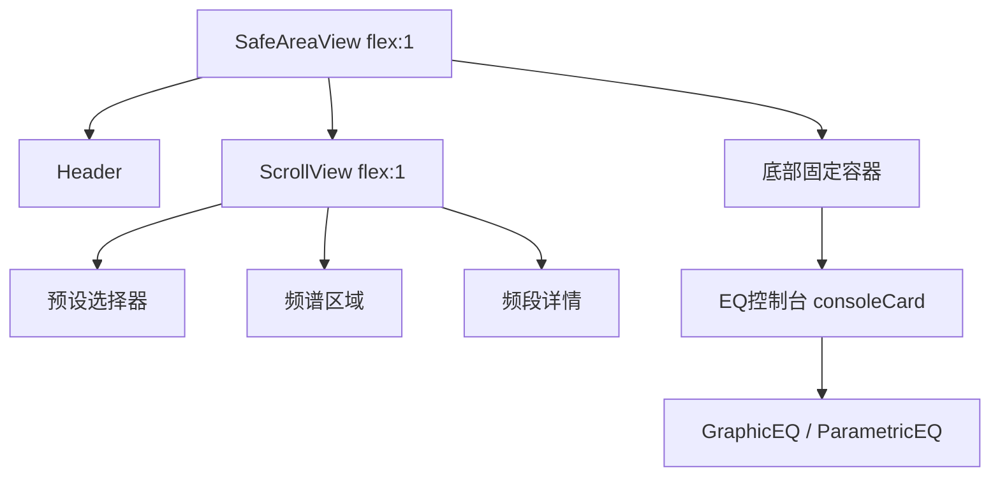
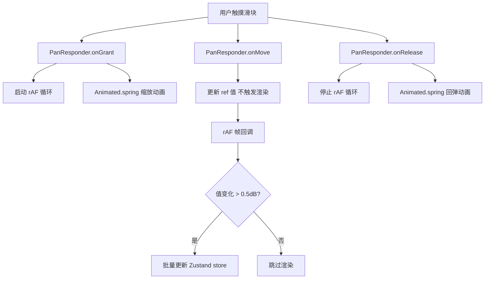

# EQ 均衡器前端重构与深度优化计划

## 总览

本计划涵盖 5 个核心重构任务，所有修改均在 `src/` 目录内，不涉及原生 Android 代码。

---

## 任务 1: 父级容器样式重构

### 现状问题
[`SoundLabScreen.tsx`](src/screens/SoundLabScreen.tsx) 中，EQ 区域（GraphicEQ/ParametricEQ）位于 `consoleCard` 内部，被 `ScrollView` 包裹，随内容整体滚动，未锁定在视口底部。

### 修改方案
1. **在 [`SoundLabScreen.tsx`](src/screens/SoundLabScreen.tsx) 中重构布局结构**：
   - 保留外部 `SafeAreaView` + `Header`
   - 将 `ScrollView` 的内容拆分为两部分：
     - **上部滚动区**：预设选择器、频谱卡片、频段详情等
     - **底部固定区**：EQ 控制台（包含 GraphicEQ/ParametricEQ）
   - 使用 flexbox 布局实现：
     ```
     SafeAreaView (flex: 1)
       ├── Header
       ├── ScrollView (flex: 1) — 预设/频谱/详情
       └── View (固定高度/auto) — EQ 底部固定容器
           └── consoleCard (含 GraphicEQ/ParametricEQ)
     ```
2. **设置 zIndex 层级**：
   - 底部 EQ 容器 `zIndex: 100`
   - 确保不与其他组件层叠上下文冲突

### 涉及文件
- [`src/screens/SoundLabScreen.tsx`](src/screens/SoundLabScreen.tsx) — 重构布局结构

---

## 任务 2: Android 安全区域适配

### 现状问题
[`App.tsx`](src/App.tsx) 最外层根容器未处理 Android 异形屏安全区域，顶部 UI 元素可能被状态栏遮挡。

### 修改方案
1. 在 [`App.tsx`](src/App.tsx) 中创建一个 `SafeAreaWrapper` 内部组件：
   - 使用 `useSafeAreaInsets()` 获取 safe area insets
   - 在根 `View` 上计算 `paddingTop: Platform.OS === 'android' ? insets.top : 0`
   - 仅对 Android 生效，iOS 由 `SafeAreaProvider` 自动处理
2. 或者使用 CSS 环境变量的替代方案：
   - `paddingTop: Platform.select({ android: StatusBar.currentHeight, ios: 0 })`

### 涉及文件
- [`src/App.tsx`](src/App.tsx) — 添加安全区域适配

---

## 任务 3: 频谱静默状态反馈

### 现状问题
当前 [`useSpectrumPoller`](src/hooks/useSpectrumPoller.ts) 在音频未播放时返回空数组，[`SpectrumView`](src/components/eq/SpectrumView.tsx) 的 Native 组件渲染空白区域，没有任何交互引导提示。

### 修改方案
两种方案可选（需确认）：

**方案 A（JS 层处理，推荐）**：
1. 在 [`SoundLabScreen.tsx`](src/screens/SoundLabScreen.tsx) 中，对 `SpectrumView` 区域增加状态判断
2. 当 `spectrum.length === 0` 或所有值为 0 时，在 `SpectrumView` 上方叠加 `View` 层
3. 占位层显示引导文案：
   - "🎵 启动播放以激活频谱动效"
   - 使用 `Animated` 创建呼吸灯脉冲效果
4. 使用 `pointerEvents="none"` 确保触摸穿透到下方组件

**方案 B（Native 层处理）**：
1. 修改 `SpectrumGLSurfaceView.kt`，当收到空数据时渲染占位文字
2. 需修改原生代码，本计划不涉及

**选用方案 A**，纯 JS 实现，无需修改原生代码。

### 涉及文件
- [`src/screens/SoundLabScreen.tsx`](src/screens/SoundLabScreen.tsx) — 添加空闲状态 UI
- [`src/components/eq/SpectrumView.tsx`](src/components/eq/SpectrumView.tsx) — 添加 fallback 状态渲染（可选）

---

## 任务 4: GraphicEQ 滑块交互重写

### 现状问题
[`EQSlider.tsx`](src/components/eq/EQSlider.tsx) 使用 `PanResponder` 处理拖拽：
- 每次 `onPanResponderMove` 直接同步调用 `onValueChange` → Zustand store 更新
- 没有 `requestAnimationFrame` 调度
- 没有节流/防抖
- 没有被动事件监听声明
- GPU 硬件加速仅用于 `scaleAnim`，未全面开启

### 修改方案
1. **引入 `requestAnimationFrame` 逐帧调度**：
   - 在 `onPanResponderGrant` 时启动 rAF 循环
   - 在 `onPanResponderMove` 中仅更新 ref 值，不触发状态更新
   - rAF 循环中读取 ref 值，批量更新 UI
   - 在 `onPanResponderRelease` 时停止 rAF 循环

2. **节流控制**：
   - 限制状态更新频率 ≤ 60fps（~16ms）
   - 值变化超过 0.5dB 时才触发更新，减少不必要的渲染

3. **GPU 硬件加速**：
   - 为滑块 `Animated.View` 添加 `renderToHardwareTextureAndroid` 属性
   - 确保 `useNativeDriver: true` 全面应用于所有动画值
   - 添加 `elevation: 12` 和 `shadowColor` 触发 GPU 复合层

4. **被动事件监听**：
   - 在 `PanResponder.create` 配置中确保 `onMoveShouldSetPanResponderCapture` 返回 `false`
   - 避免阻塞 ScrollView 滚动

5. **可选升级**（推荐）：迁移到 `react-native-gesture-handler`
   - 项目中已安装 `react-native-gesture-handler`（参见 [`App.tsx`](src/App.tsx) 中的 `GestureHandlerRootView`）
   - 使用 `GestureDetector` + `PanGesture` 替代 `PanResponder`
   - 手势处理运行在 UI 线程，天然不阻塞 JS 线程

### 涉及文件
- [`src/components/eq/EQSlider.tsx`](src/components/eq/EQSlider.tsx) — 重写事件处理逻辑

---

## 任务 5: ParametricEQ 频响曲线截断修复

### 现状问题
[`ParametricEQ.tsx`](src/components/eq/ParametricEQ.tsx) 中曲线渲染存在以下缺陷：
1. **硬编码宽度**：`GRAPH_WIDTH = Dimensions.get('window').width - 64` 在模块初始化时固定，不响应屏幕旋转或布局变化
2. **右侧 padding 不足**：`GRAPH_PAD.right = 16` 导致最高频（20000Hz）曲线点接近或超出右侧边界
3. **overflow hidden 裁剪**：`graphArea` 样式包含 `overflow: 'hidden'`，超出的曲线段被裁剪
4. **曲线段渲染使用绝对 View**：每个曲线段是单个 `View` 元素，存在精度和覆盖问题

### 修改方案
1. **动态容器宽度**：
   - 使用 `useWindowDimensions()` 替换 `Dimensions.get('window').width`
   - 或者在组件中使用 `onLayout` 回调动态获取可用宽度
   - 添加 `useEffect` 监听窗口尺寸变化

2. **修复右侧 padding**：
   - 将 `GRAPH_PAD.right` 从 16 增加到 24~32
   - 确保 `freqToX(20000)` 的计算结果不超出 `GRAPH_WIDTH - GRAPH_PAD.right`

3. **移除/放宽 overflow hidden**：
   - 将 `graphArea` 的 `overflow` 从 `'hidden'` 改为 `'visible'`
   - 确保曲线始终在 padding 范围内渲染

4. **优化曲线渲染**（可选）：
   - 当前使用多个绝对定位 `View` 元素逐段绘制曲线
   - 可改为使用 SVG（`react-native-svg`）的 `<Polyline>` 或 `<Path>` 元素
   - 但需额外依赖，如无已安装则保持现有方案，仅修复宽度问题

### 涉及文件
- [`src/components/eq/ParametricEQ.tsx`](src/components/eq/ParametricEQ.tsx) — 修复宽度计算和布局

---

## 数据流架构变更

### 频谱数据流（当前）
```
Native FFT Analyzer → AudioDSPModule.getSpectrumData()
  → useSpectrumPoller (setInterval ~80ms 轮询)
    → SpectrumView.spectrumData prop
      → SpectrumGLSurfaceView.updateSpectrum()
```

### 频谱数据流（优化后）
```
Native FFT Analyzer → AudioDSPModule.getSpectrumData()
  → useSpectrumPoller (setInterval ~80ms 轮询，+ 空闲检测)
    → SoundLabScreen (判断空闲状态)
      → SpectrumView (正常数据) / 占位层 (空闲引导)
```

注：数据流主体不变（保持在 Native 层闭环），仅在 JS 层增加 idle 状态检测和 UI 反馈。

---

## 修改文件清单

| 文件 | 任务 | 变更类型 |
|------|------|----------|
| [`src/screens/SoundLabScreen.tsx`](src/screens/SoundLabScreen.tsx) | 1, 3 | 布局重构 + 添加空闲状态 |
| [`src/App.tsx`](src/App.tsx) | 2 | 添加安全区域适配 |
| [`src/components/eq/SpectrumView.tsx`](src/components/eq/SpectrumView.tsx) | 3 | 添加 fallback 状态 |
| [`src/components/eq/EQSlider.tsx`](src/components/eq/EQSlider.tsx) | 4 | 重写事件处理 |
| [`src/components/eq/ParametricEQ.tsx`](src/components/eq/ParametricEQ.tsx) | 5 | 修复宽度和布局 |

---

## 流程图

### Task 1: 布局重构


### Task 4: 滑块交互重写

