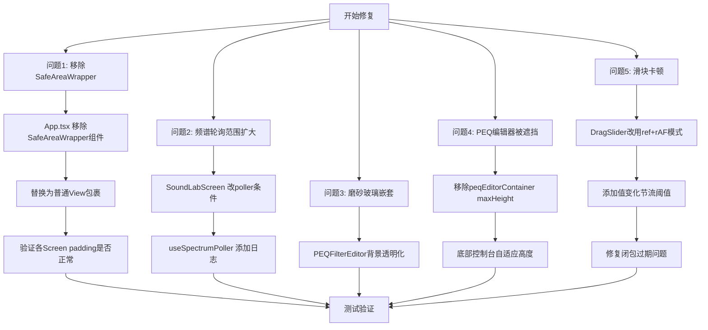

# BiliMusic Bug 修复计划

## 问题 1：安卓屏幕防顶栏遮挡双重叠加

### 根因分析

在 [`App.tsx`](../src/App.tsx:58) 中，`SafeAreaWrapper` 组件对所有屏幕统一添加了 Android 顶部安全区域 padding：
```tsx
const androidTopPadding = Platform.OS === 'android' ? Math.max(insets.top, StatusBar.currentHeight ?? 0) : 0;
```

而各个 Screen 组件又各自添加了第二层 padding：
- [`FoldersScreen.tsx:141`](../src/screens/FoldersScreen.tsx:141) — `paddingTop: insets.top`
- [`SettingsScreen.tsx:200`](../src/screens/SettingsScreen.tsx:200) — `paddingTop: insets.top`
- [`VideosScreen.tsx:235`](../src/screens/VideosScreen.tsx:235) — `paddingTop: insets.top`
- [`PlayerScreen.tsx:80`](../src/screens/PlayerScreen.tsx:80) — `paddingTop: insets.top`
- [`VisibleFoldersScreen.tsx:97`](../src/screens/VisibleFoldersScreen.tsx:97) — `paddingTop: insets.top`
- [`SoundLabScreen.tsx:65`](../src/screens/SoundLabScreen.tsx:65) — 使用 `SafeAreaView` 自动添加
- [`SyncDetailsScreen.tsx:178`](../src/screens/SyncDetailsScreen.tsx:178) — 使用 `SafeAreaView` 自动添加

两层 padding 叠加导致顶栏区域出现过多空白。

### 修复方案

**方案：保留 `SafeAreaWrapper` 统一处理，移除各 Screen 的自处理**

保留 [`App.tsx`](../src/App.tsx:58) 中的 `SafeAreaWrapper` 作为统一的 Android 顶部安全区域处理，移除各个 Screen 中的重复 padding 和独立 `SafeAreaView`。

**修改文件清单：**

1. **保留** [`App.tsx`](../src/App.tsx) 中的 `SafeAreaWrapper` 不变

2. **修改** [`FoldersScreen.tsx`](../src/screens/FoldersScreen.tsx:141)
   - 移除 `paddingTop: insets.top`
   - 将 `SafeAreaView` 改为普通 `View`

3. **修改** [`SettingsScreen.tsx`](../src/screens/SettingsScreen.tsx:200)
   - 移除 `paddingTop: insets.top`
   - 将 `SafeAreaView` 改为普通 `View`

4. **修改** [`VideosScreen.tsx`](../src/screens/VideosScreen.tsx:235)
   - 移除 `paddingTop: insets.top`
   - 将 `SafeAreaView` 改为普通 `View`

5. **修改** [`PlayerScreen.tsx`](../src/screens/PlayerScreen.tsx:80)
   - 移除 `paddingTop: insets.top`

6. **修改** [`VisibleFoldersScreen.tsx`](../src/screens/VisibleFoldersScreen.tsx:97)
   - 移除 `paddingTop: insets.top`
   - 将 `SafeAreaView` 改为普通 `View`

7. **修改** [`SoundLabScreen.tsx`](../src/screens/SoundLabScreen.tsx:65)
   - 将 `SafeAreaView` 改为普通 `View`（React Native 内置的 SafeAreaView 会自动添加 padding，与 SafeAreaWrapper 冲突）

8. **修改** [`SyncDetailsScreen.tsx`](../src/screens/SyncDetailsScreen.tsx:178)
   - 将 `SafeAreaView`（来自 react-native-safe-area-context）改为普通 `View`
   - 移除 `edges={['top', 'bottom']}` prop

---

## 问题 2：SoundLabScreen 实时频谱无效果

### 根因分析

[`SoundLabScreen.tsx:57`](../src/screens/SoundLabScreen.tsx:57) 中频谱轮询仅在 `Graphic EQ` 模式下启用：
```tsx
const { spectrum, catEarLeft, catEarRight } = useSpectrumPoller(mode === 'graphic');
```

但 `SpectrumView` 组件（第 101-106 行）在任何模式下都会渲染，导致用户在 Parametric EQ 模式下看不到频谱数据。

另外，即使切到 Graphic 模式，频谱数据需要从原生 `AudioDSPModule.getSpectrumData()` 获取，该数据仅在音频通过 DSP 引擎处理时才有值。可能存在以下问题：
1. 原生模块未正确接收音频流
2. 轮询条件过于严格

### 修复方案

**步骤 1：扩大频谱轮询范围**

将 `useSpectrumPoller` 的启用条件改为 EQ 总开关 `enabled`，而不是仅 Graphic 模式：
```diff
- const { spectrum, catEarLeft, catEarRight } = useSpectrumPoller(mode === 'graphic');
+ const { spectrum, catEarLeft, catEarRight } = useSpectrumPoller(enabled);
```

**修改文件：** [`SoundLabScreen.tsx`](../src/screens/SoundLabScreen.tsx:57)

**步骤 2：添加原生模块可用性日志/调试信息**

在 `useSpectrumPoller` 中添加调试日志，输出每次 poll 的结果数据长度，便于排查原生模块是否正常工作。

**修改文件：** [`useSpectrumPoller.ts`](../src/hooks/useSpectrumPoller.ts)

**步骤 3：[可选] 检查原生模块初始化**

确认 [`DSPAudioProcessor.kt`](../android/app/src/main/java/com/bilimusic/audio/DSPAudioProcessor.kt) 是否在 `TrackPlayer` 音频管道中正确注册。这可能需要检查原生代码中音频数据流向。

---

## 问题 3：EQ 底部磨砂玻璃嵌套

### 根因分析

[`SoundLabScreen.tsx`](../src/screens/SoundLabScreen.tsx) 中：
- `bottomConsole`（第 158 行）使用 `backgroundColor: t.colors.surface`
- 当 PEQ 编辑器展开时，[`PEQFilterEditor.tsx:77`](../src/components/eq/PEQFilterEditor.tsx:77) 内部容器也使用 `backgroundColor: t.colors.surface` 且带有 `borderRadius: 16`

在玻璃主题下，`t.colors.surface` 是半透明色（带有 alpha 通道），两层半透明背景叠加会产生视觉上的"嵌套磨砂玻璃"效果，不美观。

### 修复方案

**步骤 1：使 PEQFilterEditor 容器背景透明**

在 [`PEQFilterEditor.tsx`](../src/components/eq/PEQFilterEditor.tsx) 中，将容器背景色改为透明：
```diff
- backgroundColor: t.colors.surface,
+ backgroundColor: 'transparent',
```
移除 `borderWidth` 和 `borderColor` 样式或改为透明，让底部 console 的磨砂玻璃效果统一呈现。

**步骤 2：统一底部容器的视觉层级**

确保 `bottomConsole` 的磨砂玻璃效果只呈现一层，其内部的所有子组件（包括 PEQFilterEditor）不再叠加自己的磨砂背景。

---

## 问题 4：PEQ 编辑器被屏幕底部遮挡

### 根因分析

[`SoundLabScreen.tsx`](../src/screens/SoundLabScreen.tsx) 中：
- `bottomConsole` 设置了 `maxHeight: 380`（第 347 行）
- `peqEditorContainer` 设置了 `maxHeight: 200`（第 452 行）

当新增一个 Peak 滤波器后，`PEQFilterEditor` 组件展开，其内容高度（类型选择 + 频率滑块 + 增益滑块 + Q 值滑块 + 快速频率标签）超过了这两个高度限制，导致底部内容被遮挡。

### 修复方案

**步骤 1：移除或增加 `peqEditorContainer` 的 `maxHeight`**

```diff
  peqEditorContainer: {
-   maxHeight: 200,
    marginTop: 4,
  },
```

**步骤 2：使 `bottomConsole` 能够自适应高度，或改为可滚动**

方案 A：移除 `maxHeight: 380`，让底部控制台根据内容自动扩展高度。

方案 B：保持 `maxHeight` 但使内部可滚动，将 PEQ 编辑区域包裹在 `ScrollView` 中。

推荐**方案 A + B 组合**：
- 移除 `maxHeight` 固定值
- 将 `peqEditorContainer` 内部改为 `ScrollView` 垂直滚动
- 或者将整个底部 console 的 PEQ 区域改为可垂直滚动

**步骤 3：调整 `bottomConsole` 的布局结构**

将 `PEQFilterEditor` 从底部 console 的固定容器中移出，改为浮动层或模态面板，避免高度限制。

推荐方案：使用配置式的高度管理，根据内容动态计算。

---

## 问题 5：参数 EQ 滑块卡顿

### 根因分析

[`PEQFilterEditor.tsx`](../src/components/eq/PEQFilterEditor.tsx:277) 中的 `DragSlider` 组件存在严重的性能问题：

1. **闭包过期（Stale Closure）**：`PanResponder` 通过 `useRef` 创建一次，内部回调捕获了初始渲染时的 `value`、`min`、`max`、`step`、`onChange`。当 prop 更新时，PanResponder 内部的闭包仍然是旧值。

2. **无节流机制**：每次 `onPanResponderMove` 都直接调用 `onChange(newValue)`，这会触发 Zustand store 更新，导致整个 `PEQFilterEditor` 和 `SoundLabScreen` 重新渲染。相比之下，`EQSlider.tsx` 使用了 `requestAnimationFrame` + 节流阈值的优化方案。

3. **没有使用 ref 存储热路径值**：拖动的中间值应该先存到 ref 中，再通过 rAF 批量提交，而不是直接触发 state 更新。

### 修复方案

**步骤 1：重构 `DragSlider` 使用 ref + rAF 模式**

参考 [`EQSlider.tsx`](../src/components/eq/EQSlider.tsx) 的高性能模式，对 `DragSlider` 进行重构：

```typescript
// 核心优化点：
// 1. 使用 useRef 存储临时值，避免闭包过期
const pendingValueRef = useRef(value);
const rafRef = useRef<number | null>(null);
const isDraggingRef = useRef(false);

// 2. 使用 requestAnimationFrame 节流
const scheduleFrame = useCallback(() => {
  if (rafRef.current !== null) return;
  rafRef.current = requestAnimationFrame(() => {
    rafRef.current = null;
    commitValue(); // 批量提交
    if (isDraggingRef.current) scheduleFrame();
  });
}, []);

// 3. PanResponder 中只更新 ref，不直接触发 state
onPanResponderMove: (_, gesture) => {
  pendingValueRef.current = calculateValue(gesture.dx);
},
```

**步骤 2：将 `PanResponder` 创建移出 `useRef` 固定闭包**

改为使用 `useMemo` 并在依赖变化时重建，或者在 `useEffect` 中动态更新 panHandlers。使用 ref 回调模式来避免闭包过期问题。

**步骤 3：添加值变化节流阈值**

参考 `EQSlider.tsx` 的 `THROTTLE_THRESHOLD = 0.5`，对 `DragSlider` 添加相似的节流逻辑，值变化超过阈值才提交更新。

---

## 修改文件清单

| # | 文件 | 问题 | 修改内容 |
|---|------|------|----------|
| 1 | [`src/App.tsx`](../src/App.tsx) | 1 | 移除 `SafeAreaWrapper`，替换为直接 `View` |
| 2 | [`src/screens/SoundLabScreen.tsx`](../src/screens/SoundLabScreen.tsx) | 2, 4 | 修改 poller 启用条件；调整底部控制台高度限制 |
| 3 | [`src/hooks/useSpectrumPoller.ts`](../src/hooks/useSpectrumPoller.ts) | 2 | 添加调试日志 |
| 4 | [`src/components/eq/PEQFilterEditor.tsx`](../src/components/eq/PEQFilterEditor.tsx) | 3, 4, 5 | 背景透明化；移除 maxHeight 限制；重构 DragSlider 性能 |
| 5 | [`src/components/eq/ParametricEQ.tsx`](../src/components/eq/ParametricEQ.tsx) | 5 | DraggableNode 性能优化 |

## 流程图



---

## 测试要点

1. **问题1**：在 Android 设备上打开各个页面，确认顶部状态栏下方没有过大的空白区域
2. **问题2**：播放音乐后进入 SoundLab，确认频谱图有数据波动
3. **问题3**：在玻璃主题下打开 SoundLab PEQ 模式，确认底部只有一层磨砂玻璃效果
4. **问题4**：添加多个 PEQ Peak 滤波器，确认编辑器完整可见、不被遮挡
5. **问题5**：拖动 PEQ 滑块，确认无明显卡顿（与 Graphic EQ 滑块体验一致）
