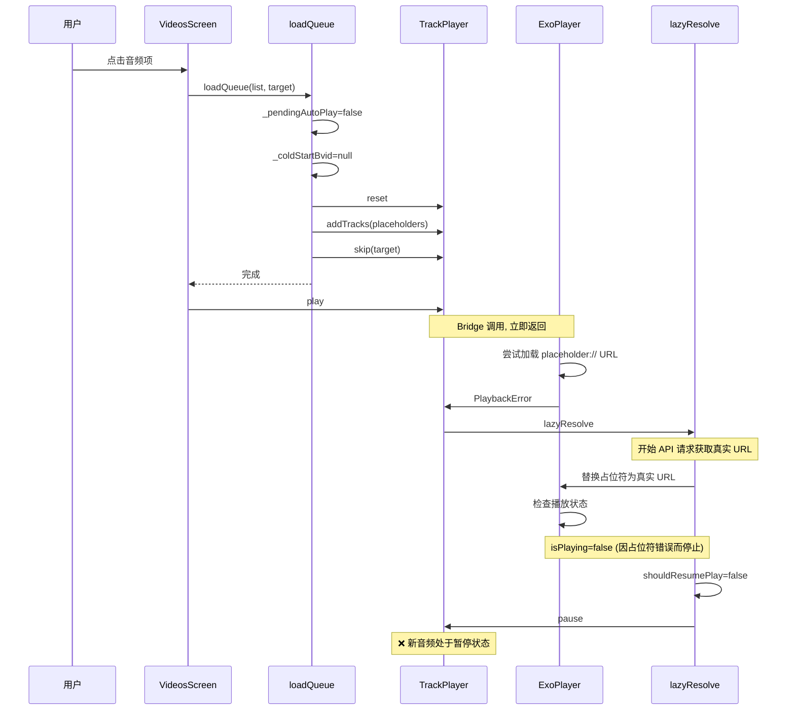
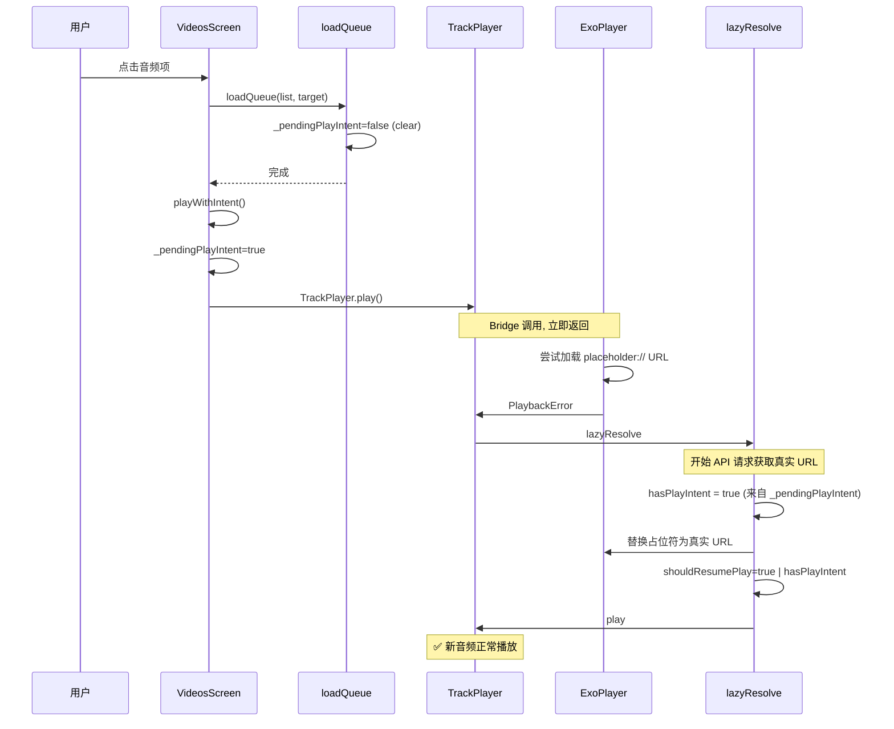

# 修复：MiniPlayer 暂停状态下从 VideosScreen/FoldersScreen 点击音频后未切换为播放状态

## 一、问题描述

当 MiniPlayer（屏幕底部最小化播放界面）处于**暂停状态**时（用户之前播放过某首歌然后点击了暂停），重新进入 VideosScreen 或 FoldersScreen（全局搜索）点击任意音频项后，虽然 UI 跳转到了播放器，但新音频**没有自动播放**，依然保持暂停状态。

**预期行为：** 无论 MiniPlayer 当前是播放还是暂停状态，用户在 VideosScreen/FoldersScreen 中点击任意音频项后，都应该**自动切换为播放状态**。

## 二、根因分析

### 2.1 点击链路

```
VideosScreen::playFrom(idx)
  → loadQueue(displayedList, target.bvid)  // 清空旧队列，建立新队列
    → _pendingAutoPlayAfterResolve = false  // **关键：清空了恢复标志**
    → _coldStartBvid = null                 // **关键：清空了冷启动标志**
    → TrackPlayer.reset()
    → addTracksBatched(...)
    → TrackPlayer.skip(targetIndex)
    → _queueStable = true
  → navigation.navigate('Player')
  → TrackPlayer.play()                      // 调用 play，但此时占位符 URL 无效
```

### 2.2 为什么播放失败

当 `TrackPlayer.play()` 对占位符轨道执行时：

1. ExoPlayer 尝试加载 `placeholder://` URL → 立即失败
2. `PlaybackError` 事件触发
3. `PlaybackError` 处理器检测到是占位符轨道错误：
   - 设置 `_pendingAutoPlayAfterResolve = true`
   - 调用 `lazyResolve(activeIndex, { version })`
4. `PlaybackActiveTrackChanged` 事件也可能触发（取决于时序）
5. `lazyResolve` 内部：
   - API 请求获取真实音频 URL（`audioService.getInfo`）
   - 替换占位符轨道为真实轨道（`skip + remove` 或 `add + remove`）
   - 替换后检查 `shouldResumePlay`：
     ```typescript
     const shouldResumePlay = _pendingAutoPlayAfterResolve || autoPlay || isPlaying;
     ```
   - **问题所在**：`_pendingAutoPlayAfterResolve` 可能被多个并发事件错误地消费/覆盖，或者 `isPlaying` 在此时为 false（因为 ExoPlayer 错误了但又还没开始新轨道）
   - 或者更精确地说：**时序窗口问题** — `PlaybackError` 设置的 `_pendingAutoPlayAfterResolve` 和 `PlaybackActiveTrackChanged` 事件处理器之间可能存在覆盖

更深层的根因是 **「显式播放意图的丢失」**：`playFrom` 中的 `TrackPlayer.play()` 是一个异步 Bridge 调用，其播放意图没有在 JS 层持久化，而是完全依赖于 ExoPlayer 的瞬时状态来判断是否应该播放。

### 2.3 关键代码路径

**文件**：`src/screens/VideosScreen.tsx:257-296` — `playFrom`
```typescript
await loadQueue(displayedList, target.bvid);  // 清空了 _pendingAutoPlayAfterResolve
navigation.navigate('Player');
await TrackPlayer.play();                      // 意图在此，但无持久化标记
```

**文件**：`src/services/trackPlayer.ts:693-711` — `lazyResolve` 播放决策
```typescript
const shouldResumePlay = _pendingAutoPlayAfterResolve || autoPlay || isPlaying;
// _pendingAutoPlayAfterResolve = false（被 loadQueue 清空）
// autoPlay = false（未传入）
// isPlaying = false（ExoPlayer 因占位符错误已停止）
// → shouldResumePlay = false → TrackPlayer.pause() 被调用
```

## 三、修复方案

### 方案选型：引入 `_pendingPlayIntent` 标志

最简洁、风险最低的方案是引入一个 `_pendingPlayIntent` 标志，当调用方显式调用了 `TrackPlayer.play()` 时设置此标志，`lazyResolve` 在替换轨道后消费此标志来决定是否播放。

**为什么不用其他方案：**
- ❌ **修改 `loadQueue` 传参**：不够通用，`PlaybackActiveTrackChanged` 也会触发 `lazyResolve`
- ❌ **修改 `PlaybackError` 处理器**：时序不确定，多个事件可能竞态
- ✅ **`_pendingPlayIntent` 标志**：简单、直接、可靠，覆盖所有调用路径

### 3.1 新增模块级标志

**文件**：`src/services/trackPlayer.ts`

在模块级变量区域（~L28-34）新增：

```typescript
/** 
 * 显式播放意图标志：当 JS 层显式调用 TrackPlayer.play() 时设置。
 * lazyResolve 在完成占位符替换后，根据此标志决定是否自动播放。
 * 
 * 与 _pendingAutoPlayAfterResolve 的区别：
 * - _pendingAutoPlayAfterResolve → PlaybackError 恢复机制
 * - _pendingPlayIntent → 用户主动触发的播放意图（VideosScreen 点击、播放全部等）
 * 
 * 生命周期：
 * - 设置：显式 play 调用前（VideosScreen::playFrom、playAll、shuffle 等调用方）
 * - 清空：loadQueue（新队列开始）、消费后（lazyResolve 内部）
 */
let _pendingPlayIntent = false;
```

### 3.2 loadQueue 中清空标志

**文件**：`src/services/trackPlayer.ts:loadQueue`（~L239）

已有逻辑清空 `_pendingAutoPlayAfterResolve` 的位置，同步清空 `_pendingPlayIntent`：

```typescript
// 清空残留的自动播放标志（上一代遗留）
_pendingAutoPlayAfterResolve = false;
// 清空显式播放意图标志（新队列开始，等待新的 play 意图）
_pendingPlayIntent = false;
```

### 3.3 创建 `playWithIntent` 替代函数

**文件**：`src/services/trackPlayer.ts`

在 `loadQueue` 之后新增一个辅助函数：

```typescript
/**
 * 显式播放当前轨道，并记录播放意图。
 * 
 * 与直接调用 TrackPlayer.play() 的区别：
 * - 此函数会设置 _pendingPlayIntent 标志，供 lazyResolve 在后续占位符替换时消费
 * - 确保用户主动触发的播放意图不会因占位符 URL 错误/异步时序而丢失
 * 
 * 适用场景：VideosScreen::playFrom、playAll、shuffle、FoldersScreen 全局搜索播放等
 */
export async function playWithIntent(): Promise<void> {
  _pendingPlayIntent = true;
  await TrackPlayer.play();
}
```

### 3.4 lazyResolve 中消费 `_pendingPlayIntent`

**文件**：`src/services/trackPlayer.ts:lazyResolve`（~L693-694）

修改 `shouldResumePlay` 的判断逻辑：

```typescript
// 消费 _pendingPlayIntent 标志
const hasPlayIntent = _pendingPlayIntent;
if (_pendingPlayIntent) {
  _pendingPlayIntent = false;  // 消费标志
}

const shouldResumePlay =
  _pendingAutoPlayAfterResolve || autoPlay || isPlaying || hasPlayIntent;
const isColdStartTarget = _coldStartBvid !== null && bvid === _coldStartBvid;
```

### 3.5 修改所有调用 `TrackPlayer.play()` 的地方

将需要确保播放意图的调用从 `TrackPlayer.play()` 改为 `playWithIntent()`：

| 文件 | 位置 | 变更 |
|------|------|------|
| `src/screens/VideosScreen.tsx` | `playFrom` (~L280) | `await TrackPlayer.play()` → `await playWithIntent()` |
| `src/screens/VideosScreen.tsx` | `playAll` (~L313) | `await TrackPlayer.play()` → `await playWithIntent()` |
| `src/screens/VideosScreen.tsx` | `shuffle` (~L343) | `await TrackPlayer.play()` → `await playWithIntent()` |
| `src/screens/FoldersScreen.tsx` | `handleRandomPlayAll` (~L140) | `await TrackPlayer.play()` → `await playWithIntent()` |
| `src/screens/FoldersScreen.tsx` | 全局搜索播放 (~L256) | `await TrackPlayer.play()` → `await playWithIntent()` |
| `src/components/PlaylistPanel.tsx` | 点击播放列表项 (~L53) | `TrackPlayer.play()` → `playWithIntent()` |

**不需要修改的地方：**
- `resumePlayback()`：它本身有自己的占位符检测 + autoPlay 逻辑
- `PlaybackService` 中的 `RemotePlay`/`RemoteNext`：这些是通过原生层调用的
- `MiniPlayer.tsx` 和 `PlayerScreen.tsx` 的播放按钮：通过 `resumePlayback()` 路径

### 3.6 `playWithIntent` 的导出

**文件**：`src/services/trackPlayer.ts`

在文件底部或导出区域，将 `playWithIntent` 加入导出列表：

```typescript
export { playWithIntent };
```

### 3.7 更新导入

在以下文件中将 `TrackPlayer` 的 `play` 导入替换为 `playWithIntent`：
- `src/screens/VideosScreen.tsx`
- `src/screens/FoldersScreen.tsx`
- `src/components/PlaylistPanel.tsx`

**注意**：这些文件可能已经有 `import { resumePlayback } from '../services/trackPlayer'`，只需在导入中添加 `playWithIntent` 即可，不必移除 `TrackPlayer` 的导入（因为其他功能仍使用 `TrackPlayer`）。

## 四、Mermaid 时序图

### 修复前（Bug）



### 修复后（使用 playWithIntent）



## 五、影响范围

| 影响点 | 说明 | 风险 |
|--------|------|------|
| `_pendingPlayIntent` 初始化 | 新增模块级 boolean | 低 |
| `loadQueue` 清空逻辑 | 添加 `_pendingPlayIntent=false` | 极低 |
| `lazyResolve` 播放决策 | 新增 `hasPlayIntent` 判定 | 中等 — 需确保标志被正确消费 |
| 调用方修改 | 5个调用点改为 `playWithIntent` | 低 |
| PlaylistPanel | 1个调用点 | 低 |

**不涉及修改的文件：**
- `MiniPlayer.tsx` — 使用 `resumePlayback` 路径
- `PlayerScreen.tsx` — 使用 `resumePlayback` 路径
- `PlaybackService` — 原生事件路径
- 所有 Store 文件

## 六、验证场景

| # | 场景 | 前置条件 | 预期结果 |
|---|------|---------|---------|
| 1 | VideosScreen 点击非首位音频 | MiniPlayer 暂停 | 新音频自动播放 |
| 2 | VideosScreen 点击首位音频 | MiniPlayer 暂停 | 新音频自动播放 |
| 3 | VideosScreen 全部播放 | MiniPlayer 暂停 | 从第一首开始播放 |
| 4 | VideosScreen 随机播放 | MiniPlayer 暂停 | 从随机结果播放 |
| 5 | FoldersScreen 全局搜索播放 | MiniPlayer 暂停 | 从点击项播放 |
| 6 | FoldersScreen 随机全部播放 | MiniPlayer 暂停 | 随机播放 |
| 7 | 以上所有场景 | MiniPlayer 播放中 | 切换后正常播放 |
| 8 | 以上所有场景 | MiniPlayer 无歌曲（冷启动） | 正常播放 |
| 9 | PlaylistPanel 选择歌曲 | 任意状态 | 跳到该歌曲并播放 |
