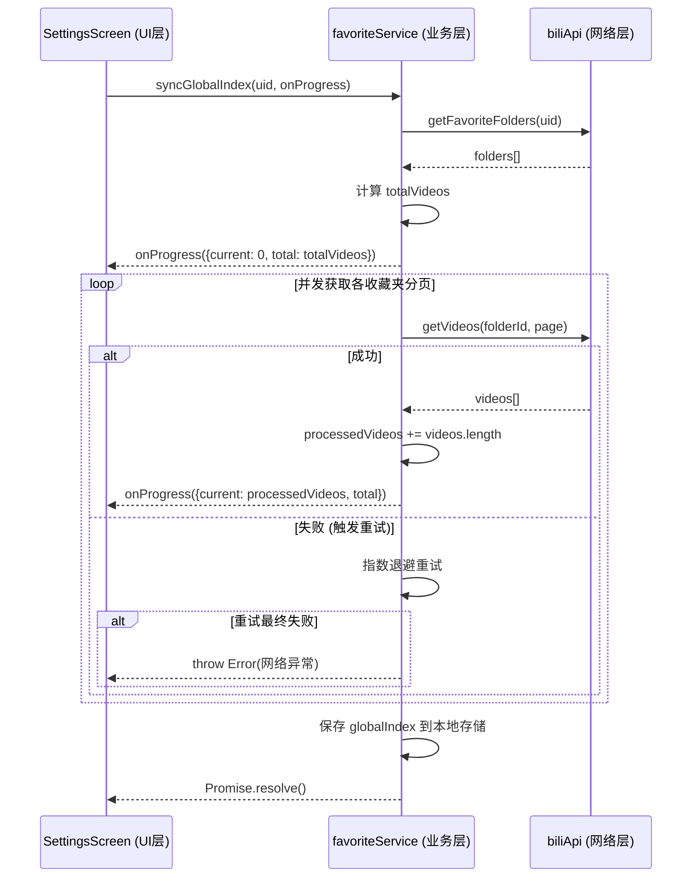

# 全局视频索引同步功能优化方案

## 一、 现状分析与痛点
当前 `SettingsScreen` 中的全局索引同步功能仅在开始时设置 `isSyncing = true`，并在结束时设置为 `false`。底层 `favoriteService.syncGlobalIndex` 没有任何进度回调机制。这导致：
1. 用户界面在同步期间（可能长达数十秒）处于停滞状态，显示“当前已索引 0 个视频”。
2. 缺乏进度反馈，用户容易误以为应用卡死。
3. 底层遇到错误时（如网络异常），部分错误被静默忽略（`catch` 后返回 `null`），导致同步不完整，且用户无感知。

## 二、 架构与接口改造设计（纯客户端方案）
由于本项目为纯客户端架构（无公网后端），所谓的“前后端通信”即为 **UI 层 (React Native)** 与 **业务逻辑层 (Services)** 之间的通信。

### 1. 状态流转逻辑
- **Idle (空闲)**: 显示上次同步的视频总数和“开始同步”按钮。
- **Syncing (同步中)**: 禁用按钮，显示动态进度条、百分比、已处理/总视频数。
- **Error (错误)**: 停止进度条，显示错误原因（如“网络超时”），按钮变为“重试”。
- **Done (完成)**: 进度条达到 100%，短暂延迟后恢复到 Idle 状态，更新总数。

### 2. 接口改造 (`favoriteService.ts`)
为 `syncGlobalIndex` 方法引入 `onProgress` 回调函数：
```typescript
export interface SyncProgressEvent {
  totalVideos: number;
  processedVideos: number;
}

async syncGlobalIndex(
  uid: string, 
  force = false, 
  onProgress?: (event: SyncProgressEvent) => void
): Promise<void>
```

**底层逻辑优化**：
1. 获取所有收藏夹后，首先计算 `totalVideos = sum(folder.mediaCount)`。
2. 立即触发一次 `onProgress({ totalVideos, processedVideos: 0 })`。
3. 在并发获取视频列表的 `executeWithBackoff` 任务完成后，累加 `processedVideos += list.length`，并触发 `onProgress`。
4. **容错处理**：移除静默忽略错误的 `catch` 块。如果某个分页重试多次后依然失败，直接向上抛出异常，中断整个同步流程，以便 UI 层捕获并展示错误。

### 3. 交互时序图


## 三、 UI 交互升级方案 (`SettingsScreen.tsx`)
1. **引入进度状态**：
   ```typescript
   const [syncState, setSyncState] = useState<'idle' | 'syncing' | 'error'>('idle');
   const [syncProgress, setSyncProgress] = useState({ current: 0, total: 0 });
   const [syncError, setSyncError] = useState('');
   ```
2. **动态进度条组件**：
   在“同步全局索引”列表项下方，当 `syncState !== 'idle'` 时，展开一个进度面板，包含：
   - 进度条轨道（背景色）与填充层（主色，宽度随百分比平滑过渡）。
   - 文本指示器：`正在同步... 45 / 120 (37%)`。
3. **错误与重试交互**：
   当捕获到异常时，进度条变红或显示错误图标，文本显示具体错误信息（如“网络连接失败”），右侧操作按钮变为“重试”。
